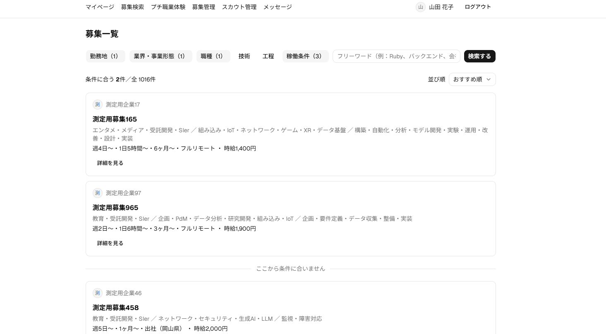
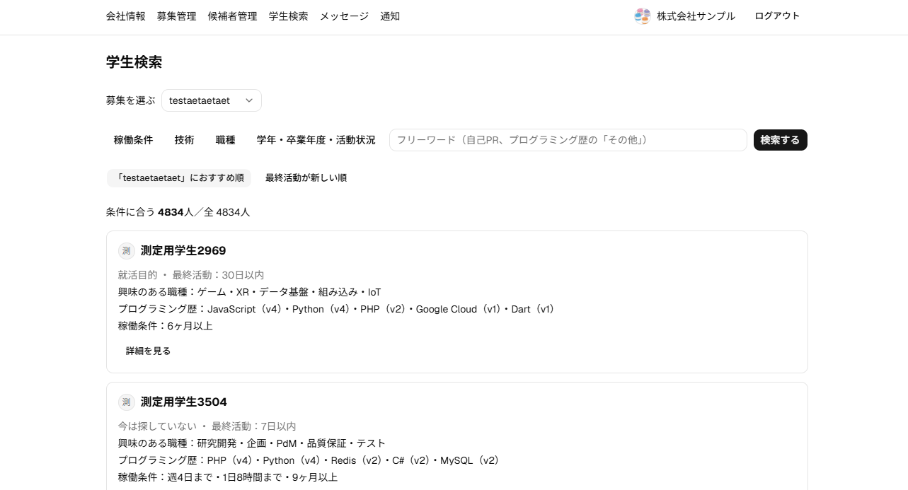
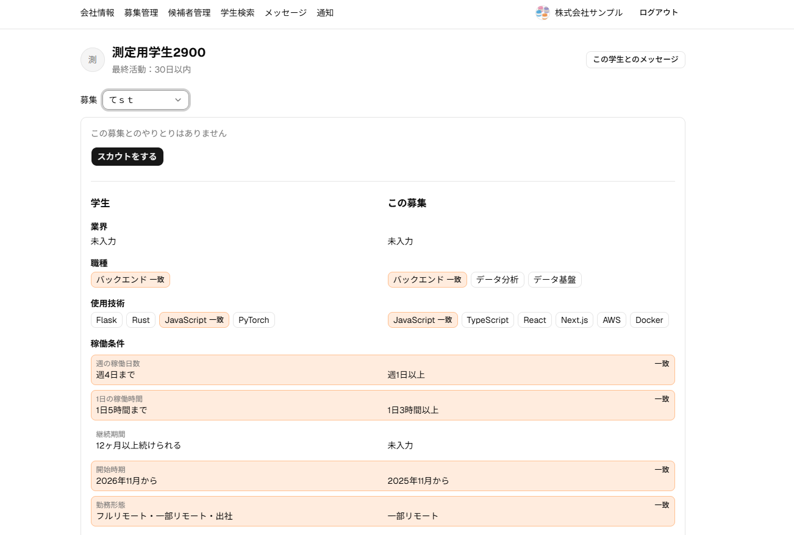
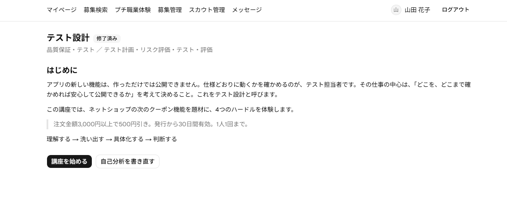
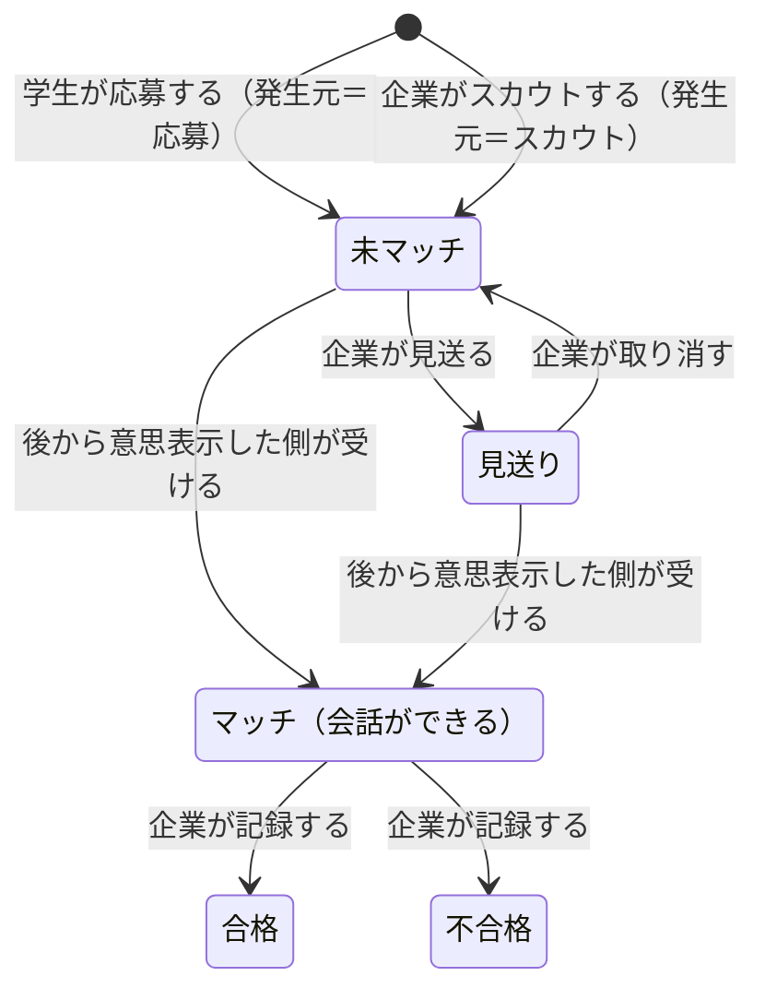

# 目次

1. [はじめに](#1-はじめに)
2. [全体像](#2-全体像)
3. [前提：何を考えて作ったか](#3-前提何を考えて作ったか)
4. [載せる情報：質の困りごとに答える](#4-載せる情報質の困りごとに答える)
5. [作る機能：量の困りごとに答える](#5-作る機能量の困りごとに答える)
6. [推し画面](#6-推し画面)
7. [技術的・設計的工夫](#7-技術的設計的工夫)
8. [動かし方](#8-動かし方)
9. [開発の進め方](#9-開発の進め方)
10. [まだ考えるべきこと・本番で必要なこと](#10-まだ考えるべきこと本番で必要なこと)
11. [リポジトリの見方](#11-リポジトリの見方)
- [未決](#未決まだ返事をもらっていない提案決めること)

---

## 1. はじめに

### サービス概要

エンジニア職の長期インターンに特化した、学生と企業の募集・スカウトサービスを作成しました。

### このサービスを利用するUser（学生・企業）の分類

長期インターンに関わる企業と学生は、それぞれ大きく2種類に分かれると考えています。

|  | 1つ目 | 2つ目 |
| --- | --- | --- |
| **企業** | 採用目的：インターンをきっかけに新卒で採用したい | 戦力目的：今すぐ開発の手を増やしたい |
| **学生** | 今はスキルがないが、伸びしろを見てほしい | すでにスキルがあり、力を活かしたい |

「採用目的の企業」は、今のスキルよりも、伸びしろや自社に合うかを見たいと考えています。
「スキルのない学生」は、実績がないと書類で落ち、伸びしろを見てもらう機会がありません。

両者の要望はかみ合うのに、今は出会う手段が足りていません。

このサービスは、**採用目的の企業と、伸びしろを見てほしい学生**を中心に作りました。
「戦力目的の企業」と「スキルのある学生」には、稼働条件とスキルを比べられる形で応えます。

### 全体の制作方針

1. **合う相手をまず見つけられる検索**
   「おすすめ検索」＋「条件で絞り込み」によって自分に合った検索候補を効率的、効果的に見つけ出せるようにしました。

2. **「募集需要と学生需要のマッチ度」と「学生の伸びしろ」が見える化**
   カルチャーや仕事への興味が合うか、学生の伸びしろがあるかを、学生は表現でき、企業は読み取れるように、載せる情報を選びました

- スクリーンショット1枚（学生詳細の比較など）
- 手元で動かす手順は「[8. 動かし方](#8-動かし方)」へ

---

## 2. 全体像

### カスタマージャーニー

| 段階 | 学生 | 企業 |
| --- | --- | --- |
| 登録 | ステップ形式の画面で、プロフィールを書きながらアカウントを作る。 | ステップ形式の画面で、会社の情報を書きながらアカウントを作る。 |
| プロフィール・募集を整える | 稼働条件、働き方の好み、興味のある職種などを書く。プチ職業体験の講座を受けて、自己分析を書く。 | 募集を作り、職種・工程・使用技術・カルチャー・稼働条件を書いて掲載する。募集に近いプチ職業体験を選ぶ。 |
| 探す | おすすめ順に並んだ募集から、気になる募集の詳細を読む。会社のカルチャーに、自分の働き方の好みが重ねて表示される。 | 募集を選び、その募集におすすめの学生を探す。学生詳細で、学生と募集の条件の一致や、自己分析を読む。似た募集に応募した学生の通知も届く。 |
| 応募・スカウト | 募集のどこに惹かれたか（応募理由）を選んで応募する。応募すると、似た募集が表示される。 | 募集を選んで、学生にスカウトを送る。スカウトの文面は、そのまま最初のメッセージになる。送ると、似た学生が表示される。 |
| マッチ | 届いたスカウトの募集を読み、惹かれた理由を選んでマッチする。 | 届いた応募を読み、マッチするか見送るかを決める。 |
| メッセージ | マッチした企業と、メッセージで話す。 | マッチした学生と、メッセージで話す。面談の結果に合わせて、合格・不合格を記録する。 |
| 日程調整から先 | サービスの外で、面談などに進む。 | メッセージで、外部のフォームなどを案内する。 |

### 機能一覧

サービスの範囲は「募集の掲載 → スカウト・応募 → マッチ → メッセージ開始」までです。面談日程の調整から先は、企業側の手段（外部のフォームやメール）に任せます。

| 分類 | 機能 | 主な画面 |
| --- | --- | --- |
| アカウント | 企業・学生の新規登録（ステップ形式）、ログイン・ログアウト | 新規登録、ログイン |
| プロフィール | 企業プロフィール・学生プロフィールの編集、アイコン画像 | 企業プロフィール編集、マイページ |
| 募集 | 募集の作成・編集、状態（非公開／掲載中／終了）の切り替え | 募集一覧（企業）、募集詳細編集 |
| 探す | 学生による募集の検索、企業による学生の検索、企業詳細の閲覧 | 募集一覧（学生）、学生検索、企業詳細 |
| スカウト・応募・マッチ | スカウトの送信、応募、マッチ、見送り・合格・不合格、候補者の整理 | 学生詳細、募集詳細、候補者一覧、募集管理、スカウト管理 |
| メッセージ | 企業×学生の1スレッドでの送受信（マッチが1つもない間は送れない） | メッセージ管理 |
| おすすめ | 募集一覧のおすすめ順、「○○募集におすすめ順」の学生検索、似た学生・似た募集のポップアップ | 募集一覧（学生）、学生検索、学生詳細、募集詳細 |
| 通知（企業向けのみ） | 似た募集に応募した・スカウトに応じた（今動いている）学生を「おすすめの学生」として知らせる | 通知 |
| 比較の表示 | 稼働条件・職種・技術・業界の一致と、カルチャー5軸のずれ | 学生詳細、募集詳細 |
| プチ職業体験 | 学生が職種ごとの短い講座を受けて自己分析を書く。企業は募集に近い講座を選び、学生詳細で自己分析を読む | プチ職業体験一覧、プチ職業体験、プチ職業体験の内容（企業）、募集詳細編集、募集詳細、学生詳細 |

#### 作らない機能（主なもの）

- 学生向けの通知
- お気に入り、特定企業のブロック、口コミ
- パスワードの再設定、メールアドレスの確認（メール送信が必要になるため今回は後回し）
- メッセージ・通知のリアルタイム更新（画面を開いたとき・再読み込みしたときに最新を取る。リアルタイム性はそこまで求めていないと判断）
- 運営（管理者）の画面
- 1社に複数の担当者（1社1アカウント）

---

## 3. 前提：何を考えて作ったか

### 企業の要望を中心に考える

お金を払うのは企業なので、企業の要望を中心に考えました。ただし、学生が使わなければサービスは成り立たないので、学生が自分のために入力するものが、そのまま企業の材料になるようにしています。

### 企業は2種類いる

「はじめに」のとおり、企業には採用目的と戦力目的があります。多くの企業は、その両方をいくらかずつ持っています。

目的が違うと、学生について知りたいことの重みが変わります。戦力目的の企業は、「週に何日、1日何時間働けるか」「今どの言語をどれくらい書けるか」を重く見ます。採用目的の企業は、今のスキルよりも「伸びしろがあるか」「うちを就職先の候補として見てくれるか」を重く見ます。この両方の要望に応える必要がある、と整理しました。

### 情報は2種類ある

企業が学生について知りたい情報は、確かさで2つに分かれます。

- **断言できる情報**：今のスキル、働ける期間、稼働時間。「週3日・1日5時間まで・6か月以上」のように、学生が答えればそのまま比べられます（ただし自己申告です）
- **推測するしかない情報**：カルチャーに合うか、興味があるか、伸びしろ、就職先の候補として見てくれるか、申告どおり続けてくれるか。学生に「御社のカルチャーに合います」と書いてもらっても、企業には確かめようがありません

後者は、自己PR の文章や面接から推し量るしかありません。そこで、このプロダクトの役割を「**推測するしかない情報を、少しでも確かにする材料を増やすこと**」と決めました。

### 企業の困りごとは「質」と「量」

2種類の企業の困りごとを集め、「質」（学生を推測する確かさ）と「量」（出会いの数）に分けました。

| 種類 | 企業の困りごと |
| --- | --- |
| 質 | カルチャーに合うかわからない |
| 質 | 自社の事業に興味があるかわからない |
| 質 | 職種に興味があるか、向いているかわからない |
| 質 | 期間いっぱい続けてくれるかわからない |
| 質 | 就職先の候補として見てくれるかわからない |
| 質 | スキルの自己申告を信じきれない |
| 量 | 募集が学生に見つけてもらえない |
| 量 | スカウトを送る相手を選ぶ手間が大きい |
| 量 | スカウトしても返事が来ない |
| 量 | 条件に合う学生がいない |

> **質の困りごとには、主に「プロフィールに載せる情報」で答え（[4章](#4-載せる情報質の困りごとに答える)）、量の困りごとには、主に「機能」で答えました（[5章](#5-作る機能量の困りごとに答える)）。**

---

## 4. 載せる情報：質の困りごとに答える

企業が知りたいことを7つにまとめ、それぞれについて、学生のプロフィールと募集に載せる情報を決めました（◎は特に重く見るもの）。

学生と募集は、できるだけ**同じ形**で情報を持つようにしました。たとえば、カルチャーは同じ5つの軸で答え、稼働条件は学生が「週○日まで」、企業が「週○日以上」を同じ選択肢で答えます。職種・業界・技術も、共通の一覧から選びます。同じ形だから、項目ごとに比べたり、合う相手を探したりできます（[7章](#7-技術的設計的工夫)）。

| 企業が知りたいこと | 採用目的 | 戦力目的 | 学生のプロフィール | 募集 |
| --- | :---: | :---: | --- | --- |
| 自社のカルチャーに合うか | ○ | ○ | 働き方の好み（5軸） | カルチャー（同じ5軸） |
| 業務内容・プロダクトに興味を持ってくれるか | ○ | ○ | 興味のある業界・職種 | 業界・事業形態・職種・工程、インターンですること、成長イメージ |
| 一定の期間、続けてくれるか | ○ | ○ | 続けられる期間、始められる時期、稼働条件の備考 | 最低の期間、開始の時期、稼働条件の備考 |
| 今すでにスキルがあるか |  | ◎ | プログラミング歴（技術・年数・レベル4段階）、外部リンク、資格 | 使用技術、必須要件・歓迎要件 |
| 一定の時間、働いてくれるか |  | ◎ | 週の日数・1日の時間の上限、勤務形態、出社できる都道府県 | 週の日数・1日の時間の下限、勤務形態、勤務地、土日OK |
| 伸びしろがあるか | ◎ |  | 自己PR（強み・向いていないこと・この先やりたいこと）、プチ職業体験の自己分析 | 近いプチ職業体験 |
| 就職先の候補として見てくれるか | ◎ |  | 学年、卒業年度、活動状況（就活目的など）、就活希望エリア | 目的（採用・戦力・両方）、採用につながる可能性、求める学年・卒業年度（学生には見せない） |

---

## 5. 作る機能：量の困りごとに答える

量の困りごとには、機能で答えました。質の困りごとのうち、情報を載せるだけでは足りないものも、機能で補っています。

| 種類 | 企業の困りごと | 作った機能 |
| --- | --- | --- |
| 量 | 募集が学生に見つけてもらえない | ・募集一覧のおすすめ順。<br>・学生の応募後似た募集のおすすめを表示。 |
| 量 | スカウトを送る相手を選ぶ手間が大きい | ・募集ごとのおすすめ順の学生検索。<br>・スカウト後の似た学生。<br>・「おすすめの学生」の通知 |
| 量 | スカウトしても返事が来ない | ・30日以上活動のない学生を検索から外し、最終活動の目安を出す |
| 量 | そもそも条件に合う学生がいない | ・今回は対応しない |
| 質 | 自社の事業に興味があるかわからない | ・応募・マッチのときに、募集のどこに惹かれたか（事業内容、成長イメージ、時給など12項目）を選んでもらい、学生詳細に出す |
| 質 | カルチャーや条件が合うかわからない | ・学生と募集の比較の表示（項目ごとの一致と、カルチャーの5軸のずれ） |
| 質 | 職種に向いているか、伸びしろがあるかわからない | ・プチ職業体験 |

---

## 6. 推し画面

### 募集一覧（学生の募集検索）
学生が、応募する募集を探す画面です。

業界・職種・工程・稼働条件などの条件を入れると、条件に合う募集を上に、合わない募集を下の枠に分けて、すべて表示します。条件で結果を減らさないので、どんな条件で探しても一定の数の募集が目に入ります。「自分の稼働条件で選ぶ」ボタンを押すと、プロフィールの稼働条件がそのまま条件に入ります。並び順は、新着順とおすすめ順を選べます（おすすめ順の計算は[7章](#7-技術的設計的工夫)）。



### 学生検索（企業）

企業が、スカウトを送る学生を探す画面です。募集一覧と同じく、条件に合う学生を上、合わない学生を下に分けて表示します。自社の募集を1つ選ぶと、その募集におすすめの順に学生が並びます。募集を2つ作っていれば、2通りのおすすめ順で探せます。



### 学生詳細（企業）
企業が、学生のプロフィールを読み、スカウト・マッチ・見送りをする画面です。

学生と募集が同じ形で情報を持っているので、比べることができます。自社の募集を選ぶ欄で切り替えると、その募集と学生の条件を左右に並べ、項目ごとに一致しているかを示します。カルチャーは、5つの軸それぞれで学生と募集の2つの点を重ねて見せます。応募理由（募集のどこに惹かれたか）と、プチ職業体験の自己分析も、この画面で読めます。



### プチ職業体験（学生）

学生が、ある職種の仕事で、各段階に何を考えて何をするのかを、短く体験する画面です。

今ある講座は「テスト設計」の1本です。「注文金額3,000円以上で500円引き。発行から30日間有効。1人1回まで」というクーポン機能を題材に、テスト担当者が考える4つの段階（理解する → 洗い出す → 具体化する → 判断する）を、15〜20分の解説と選択式の問題で体験します。最後に自己分析として、いちばん得意だと感じた段階と伸ばしたい段階を1つずつ選び、その理由を書きます。

- **学生にとって**：インターンで任される仕事を、具体的にイメージしやすくなると考えています
- **企業にとって**：学生がどの段階を得意だと感じ、どこを伸ばしたいと思っているかがわかります。学生詳細で自己分析を読みます
- **生成 AI への備え**：正解のある問題は AI に解かれて差が出ないので、問題の正否は記録せず、企業にも見せません。企業に渡すのは、正解のない自己分析だけです

> ただし、企業にとっての有用性は、まだ確かめられていません。学生がそもそも講座に取り組んでくれるか、企業が自己分析を読んで本当に学生のことがわかるかは、はっきりしていません。自己分析を読むのは人事の担当者だと想定されるので、技術寄りの内容では伝わらない可能性もあります。講座の文面や企業に見せる情報には、改良の余地があります。



---

## 7. 技術的・設計的工夫

### データベース設計

#### やり取りテーブル・メッセージテーブル：学生と企業の関係が、サービスの中でどう変わるかを反映

抽象的に考えると、このサービスは「学生と企業が無関係な状態から、関係を築くのを手伝うもの」です。関係の移り変わりは、次のようになります。



応募とスカウトは、関係を始めるきっかけ（発生元）が違うだけで、未マッチから先は同じ動きをします。そこで、応募とスカウトを「やりとり」という1つの表にまとめ、発生元と状態を別の列で持ちました。

**やりとり（募集×学生で1件）**

| 列 | 中身 |
| --- | --- |
| 募集 | どの募集か |
| 学生 | どの学生か |
| 発生元 | 応募／スカウト（作った後は変えない） |
| 状態 | 未マッチ／マッチ／見送り／合格／不合格 |
| マッチした日時 | マッチが成立した日時 |

- 同じ募集×学生には1件だけ（UNIQUE 制約）。ボタンが2回押されても重複しない

また、やりとりは「募集×学生」、会話は「企業×学生」で1本にしました。同じ企業から2つの募集でスカウトされたときに、募集ごとに会話を分けると、同じ相手とのやりとりが複数の画面に散らばるためです。既存のサービスにも、候補者の画面とメッセージの画面が分かれていて、運営自身が「混同しやすい」と注意書きを出している例があります。

| 表 | 単位 | 中身 |
| --- | --- | --- |
| スレッド | 企業×学生で1本 | 最後のメッセージの日時 |
| メッセージ | 1通ずつ | 本文、送った人 |
| スカウト文 | スカウト1件につき1つ | どのメッセージが、どのやりとりのスカウトか |

- 同じ企業が2つの募集でスカウトすると、1本のスレッドにスカウト文が2つ並び、それぞれどの募集のスカウトかを表示できる

#### マスタテーブル

学生と募集が同じ形で情報を持てるように、選ぶ項目の一覧（マスタ）を共通にしました。

| マスタ | 数 | 何を表すか | どこで使うか |
| --- | --- | --- | --- |
| 職種 | 大分類4・中分類21 | どんな仕事か（フロントエンド、データ分析、品質保証・テストなど） | 募集、学生の興味のある職種、検索、おすすめ、プチ職業体験の講座 |
| 工程 | 13 | 仕事のどの段階か（企画・要件定義 → 実装 → 運用・改善など） | 募集（メイン／関われる）、検索、おすすめ（募集どうし）、講座のタグ |
| 技術 | 52 | 言語・フレームワーク・クラウドなど | 募集の使用技術、学生のプログラミング歴、検索、おすすめ |
| 業界 | 15 | 何の分野の事業か（EC・小売、金融、教育など） | 募集、学生の興味のある業界、検索、おすすめ |
| 事業形態 | 4 | 誰にどう提供するか（自社サービス、受託開発など） | 募集、検索 |

- **軸を分けた**：「どんな仕事か（職種）」「どの段階か（工程）」「何の分野か（業界）」「誰にどう売るか（事業形態）」を別の一覧にし、検索で掛け合わせる。1つの木に混ぜると、項目の数が爆発するため
  - 例：以前は職種に「SE（要件定義・設計）」を置いていたが、「バックエンド × 上流の工程」で表せるので、工程の側に移した
- **1つの一覧を全体で共通に使う**：同じ職種の一覧を、募集・学生・検索・講座のすべてで使う。だから比べられる
- **消さない**：一覧の項目は削除しない。募集・学生・講座がすべて指しているため

詳しくは [docs/データベースについて.md](docs/データベースについて.md) へ

---

### 検索・おすすめ：近さの定義と計算

検索には、条件で結果を減らさない検索（[6章](#6-推し画面)）と、おすすめ順があります。おすすめ順とおすすめの表示は、次の**3つの近さ**で計算しています。

| 近さ | 使う場面 |
| --- | --- |
| 募集×学生 $f(P, S)$ | 募集一覧のおすすめ順、学生検索の「○○募集におすすめ順」 |
| 学生どうし $f(S_i, S_j)$ | スカウト後の「この学生に似た学生」 |
| 募集どうし $f(P_i, P_j)$ | 応募後の「この募集に似た募集」、「おすすめの学生」の通知 |

どの近さも、記入した情報から測る「**内容の近さ**」と、応募やマッチから測る「**行動の近さ**」を組み合わせています。

#### 記号と決めている値

| 記号 | 意味 |
| --- | --- |
| $P$、$P_i$、$P_j$ | 募集（添え字は、別々の募集を区別するため） |
| $S$、$S_i$、$S_j$ | 学生（同上） |
| $X$、$Y$ | 比べる2つ（募集と学生、学生どうし、募集どうしのどれか） |
| $A(S)$ | 学生 $S$ が興味を示した募集の集まり |
| $B(P)$ | 募集 $P$ に興味を示した学生の集まり |
| $P'$、$S'$ | $A(S)$ の中の1つの募集、$B(P)$ の中の1人の学生 |
| $T_k(X)$ | $X$ が選んだ項目 $k$ の集まり（例：職種の集まり、技術の集まり） |
| $x_a$、$y_a$ | $X$、$Y$ のカルチャー（働き方の好み）の、$a$ 番目の軸の値（−2〜2） |
| $\lvert \cdot \rvert$ | 集まりの中の数 |

「興味を示した」とは、**学生自身の意思表示**（応募と、スカウトへのマッチ。どちらも応募理由つき）のことです。スカウトを受けただけのもの、見送り、不合格は使いません。

| 値 | 意味 | 値 |
| --- | --- | --- |
| $\lambda$ | 行動の近さを信じ始める件数の目安 | 10 |
| $w_{\max}^{P}$、$w_{\max}^{S}$ | 募集どうし・学生どうしで、行動の近さを重く見る上限 | 0.6、0.7 |
| $\gamma$ | 募集×学生で、$I$ と $U$ それぞれを重く見る上限 | 0.3 |
| $\beta$ | 応募理由が重ならなくても与える基礎点 | 0.5 |

#### 部品1：内容の近さ

学生と募集が同じ形で情報を持っているので、項目 $k$ ごとに近さ $s_k$ を出し、項目の重み $w_k$ で平均します。

$$
\mathrm{Content}(X, Y) = \frac{\sum_k w_k\, s_k(X, Y)}{\sum_k w_k}
$$

| 項目 $k$ | 使う組 | 近さ $s_k(X, Y)$ |
| --- | --- | --- |
| 職種 | すべて | 中分類の集まりの $\mathrm{Jac}$。1つも重ならないときは、大分類の集まりの $\mathrm{Jac} \times 0.5$ |
| 技術 | 学生どうし、募集どうし | $\mathrm{Jac}\big(T_{技術}(X),\ T_{技術}(Y)\big)$ |
| 技術 | 募集×学生 | $\dfrac{\lvert T_{技術}(P) \cap T_{技術}(S) \rvert}{\lvert T_{技術}(P) \rvert}$（募集の使用技術のうち、学生が持っている割合。学生が募集にない技術を持っていても下がらない） |
| 業界 | すべて | $\mathrm{Jac}\big(T_{業界}(X),\ T_{業界}(Y)\big)$ |
| 工程 | 募集どうしだけ | $\mathrm{Jac}\big(T_{工程}(X),\ T_{工程}(Y)\big)$ |
| カルチャー・働き方の好み | すべて | $\dfrac{1}{5} \sum_{a=1}^{5} \left( 1 - \dfrac{\lvert x_a - y_a \rvert}{4} \right)$ |

ここで $\mathrm{Jac}$ は、2つの集まりの重なりの割合（ジャカード係数）です。

$$
\mathrm{Jac}\big(T_k(X),\ T_k(Y)\big) = \frac{\lvert T_k(X) \cap T_k(Y) \rvert}{\lvert T_k(X) \cup T_k(Y) \rvert}
$$

- どちらかが未入力の項目は0点。入力が多いほど上に出やすくなる
- 大学名・学部・住んでいる都道府県は使わない（本人の適性と関係ないため）

#### 部品2：行動の近さ

大量に応募する学生や、人気の募集の影響を下げる重みを使います。

$$
u(S) = \frac{1}{\log\big(1 + \lvert A(S) \rvert\big)}, 
$$
$$
u(P) = \frac{1}{\log\big(1 + \lvert B(P) \rvert\big)}
$$

募集どうしは「両方の募集に興味を示した学生」を、学生どうしは「両方の学生が興味を示した募集」を数えます（共起）。

$$
\mathrm{Co}_P(P_i, P_j) = \sum_{S \in B(P_i) \cap B(P_j)} u(S), 
$$
$$
\mathrm{Co}_S(S_i, S_j) = \sum_{P \in A(S_i) \cap A(S_j)} u(P)\, g_P(S_i, S_j)
$$

- $g_P(S_i, S_j)$：2人が募集 $P$ に付けた応募理由（12項目）の重なり。$\beta + (1 - \beta) \times$（2人の応募理由の $\mathrm{Jac}$）

自分自身との共起 $W$ で割って、0〜1に収めます。

$$
\mathrm{CF}_P(P_i, P_j) = \frac{\mathrm{Co}_P(P_i, P_j)}{\sqrt{W(P_i)\, W(P_j)}}, 
$$
$$
\mathrm{CF}_S(S_i, S_j) = \frac{\mathrm{Co}_S(S_i, S_j)}{\sqrt{W(S_i)\, W(S_j)}}
$$

$$
W(P) = \mathrm{Co}_P(P, P) = \sum_{S \in B(P)} u(S), 
$$
$$
W(S) = \mathrm{Co}_S(S, S) = \sum_{P \in A(S)} u(P)
$$

#### 組み合わせ方：行動が少ないうちは内容を重く見る

興味の数 $n$ に応じて、行動の近さをどれだけ信じるかを決めます。

$$
c(n) = \frac{n}{n + \lambda}
$$

**募集どうし・学生どうし**

$$
f(P_i, P_j) = (1 - w_B)\,\mathrm{Content}(P_i, P_j) + w_B\,\mathrm{CF}_P(P_i, P_j), 
$$
$$
w_B = w_{\max}^{P} \cdot c\Big(\min\big(\lvert B(P_i) \rvert,\ \lvert B(P_j) \rvert\big)\Big)
$$


$$
f(S_i, S_j) = (1 - w_B)\,\mathrm{Content}(S_i, S_j) + w_B\,\mathrm{CF}_S(S_i, S_j), 
$$
$$
w_B = w_{\max}^{S} \cdot c\Big(\min\big(\lvert A(S_i) \rvert,\ \lvert A(S_j) \rvert\big)\Big)
$$

- 例：興味が0件なら $w_B = 0$ で、内容の近さだけで並ぶ。2つの募集にどちらも10人の興味があれば、$w_B = 0.6 \times \frac{10}{10 + 10} = 0.3$

**募集×学生**

$$
f(P, S) = w_C\,\mathrm{Content}(P, S) + w_I\, I(P, S) + w_U\, U(P, S)
$$

$$
I(P, S) = \frac{1}{\lvert A(S) \setminus \{P\} \rvert} \sum_{P' \in A(S) \setminus \{P\}} f(P, P'), $$
$$
U(P, S) = \frac{1}{\lvert B(P) \setminus \{S\} \rvert} \sum_{S' \in B(P) \setminus \{S\}} f(S, S')
$$

$$
w_I = \gamma \cdot c\big(\lvert A(S) \rvert\big), \qquad
w_U = \gamma \cdot c\big(\lvert B(P) \rvert\big), \qquad
w_C = 1 - w_I - w_U
$$

- $I$：学生 $S$ が興味を示した募集たちに、$P$ がどれだけ似ているか
- $U$：募集 $P$ に興味を示した学生たちに、$S$ がどれだけ似ているか
- どちらも自分自身（$P$ や $S$）は除いて平均する。除いた後に何も残らなければ0

#### エンベディングを使わなかった理由

最初は、自己PR や募集の概要を文章のエンベディング（密ベクトル）にして、意味の近さで測るつもりでした。しかし、プロフィールはよく書き換えられます。また、自己PR と募集の概要の意味が近くても、どんな学生がどんな募集に惹かれるかはわかりません。そこで、文章の意味の近さを測ってためておくのではなく、その文章を読んだ学生が実際に応募したかどうかで測る方針に変えました。

#### 大規模でも速く：多段階の検索

学生10万人・募集1万件を想定しています。全員について $f(P, S)$ を計算すると重いので、2段階に分けました。

1. 軽い点 $F_1$ で、候補を上位100件まで絞る。$F_1$ は、重い $I$・$U$ の代わりに、行動の近さ $\mathrm{CF}_P$ の平均 $\tilde{I}$ を使う

$$
F_1(P, S) = w_C\,\mathrm{Content}(P, S) + (w_I + w_U)\,\tilde{I}(P, S), 
$$
$$
\tilde{I}(P, S) = \frac{1}{\lvert A(S) \setminus \{P\} \rvert} \sum_{P' \in A(S) \setminus \{P\}} \mathrm{CF}_P(P, P')
$$

2. 絞った100件だけ、本物の $f(P, S)$ で並べ直す。101件目以降は新着順（学生検索は最終活動の順）

#### ためる値・ためない値

| 式の中の値 | ためるか | いつ更新するか | 理由 |
| --- | --- | --- | --- |
| $\lvert A(S) \rvert$、$\lvert B(P) \rvert$（興味の数） | ためる | 応募・マッチが確定した後に、裏側のジョブで | $u$ と $c(n)$ で毎回使う |
| $W(S)$、$W(P)$（自分自身との共起） | ためる | 同上 | $\mathrm{CF}$ の分母。数えるには、相手全員の興味の数が要る |
| $\lvert T_k(X) \rvert$（項目ごとの数） | ためる | プロフィール・募集の保存と同じトランザクションで | $\mathrm{Jac}$ の分母 $\lvert T_k(X) \cup T_k(Y) \rvert = \lvert T_k(X) \rvert + \lvert T_k(Y) \rvert - \lvert T_k(X) \cap T_k(Y) \rvert$ に使う。検索のたびに数えると、学生10万人分の項目（約150万行）を読むことになる |
| $\mathrm{Co}_P$、$\mathrm{Co}_S$、$\mathrm{CF}_P$、$\mathrm{CF}_S$ | ためない | 表示のたびに計算 | ためると、学生どうしだけで最大約2億行になる |
| $\mathrm{Content}$ | ためない | 表示のたびに計算 | 募集×学生だけで10億組になる |
| $f$、$I$、$U$、$F_1$、似たもののリスト | ためない | 表示のたびに計算 | 似たもののリストは、応募のたびに作り直すと重い |

- ためる値は、差分を足し引きせず、毎回元のデータから数え直す。ジョブが失敗して再実行しても、値がずれない

詳しくは [docs/検索について.md](docs/検索について.md) へ

### そのほかの技術方針

#### 技術構成

| 分類 | 使うもの | 補足 |
| --- | --- | --- |
| バックエンド | Rails 8（API モード） | 画面は作らず、API だけを担当する |
| フロントエンド | Next.js | 画面はすべてこちらで作る |
| データベース | PostgreSQL | 配列型・JSON 型が使える |
| 動かし方 | Docker | データベース・Rails・ジョブの実行係・Next.js の4つのコンテナ |

#### 通信の経路

```
ブラウザ → Next.js（3000番）→ 転送（rewrites）→ Rails（3001番）
```

- ブラウザから見ると同じオリジンになる。
- ログイン後の画面では、データの取得・送信をすべてブラウザからこの経路で行う。Next.js のサーバー側から Rails を呼ばない

#### 守りと判定は Rails に置く

- **権限の確認は Rails で行う**。画面側の振り分けは見た目のためだけ
- **判定も Rails で計算して返す**。やりとりのタグ、押せるボタン、稼働条件の一致、メッセージを送れるかなど。Rails と Next.js は言語が違うので、同じ判定を両方に書くと2通りの実装になり、いずれ食い違うため
- **番号は、その人が見てよい範囲の中から探す**。他社の募集や、見てよい範囲の外の番号は、「ない」（404）として返す。存在するかどうかも漏らさない

#### 処理のまとまりと、裏側のジョブ

- 途中で失敗したときに半端な状態が残らないよう、スカウトの送信（やりとり・スレッド・メッセージ・スカウト文）、新規登録、プロフィールの保存などを、1つのトランザクションでまとめて保存する
- 推薦の集計の更新と通知の作成は、トランザクションが確定した後に、裏側のジョブで行う。推薦の計算が失敗しても、応募そのものは失敗しない（詳しくは [docs/検索について.md](docs/検索について.md)）
- 同時に2回押されても、データベースの UNIQUE 制約で重複を防ぐ（詳しくは [docs/データベースについて.md](docs/データベースについて.md)）

#### テスト

- Rails の API のテストが中心（RSpec ＋ FactoryBot）。権限の確認と、主な流れ（登録 → 募集 → スカウト → メッセージ）を通す

---

## 8. 動かし方

### 必要なもの

- Docker Desktop
- bash（Mac・Linux は標準のもの。Windows は Git に付いてくる Git Bash）

### 起動する

リポジトリのルートで、次の1行を実行します。

```bash
bash dev.sh setup
```

`setup` は、次の4つを順に行います。何度実行してもかまいません（すでにあるものは作り直しません）。

1. `code/.env` がなければ、見本の `code/.env.example` から作る
2. コンテナ（データベース・Rails・ジョブの実行係・Next.js）を作る。初回は部品のインストールで数分かかる
3. データベースを作り、テーブルと試しのアカウントを入れる
4. 起動する

起動したら、ブラウザで http://localhost:3000 を開きます。開発用の起動なので、各画面を初めて開いたときは十数秒かかります。

### 試しのアカウントと仮のデータ

| 種別 | メールアドレス | パスワード |
| --- | --- | --- |
| 企業 | company@example.com | password |
| 学生 | student@example.com | password |

いろいろなデータで試したいときは、仮のデータ（企業5社・募集20件・学生20人と、応募・スカウト・メッセージ）を入れられます。何度実行しても、前回の仮のデータを消して作り直します。

```bash
bash dev.sh demo
```

| 種別 | メールアドレス | パスワード |
| --- | --- | --- |
| 企業 | demo-company1@example.com 〜 demo-company5@example.com | password |
| 学生 | demo-student1@example.com 〜 demo-student20@example.com | password |

### 体験の筋書き

2章のカスタマージャーニーの順に触ると、このサービスの特徴が一通り見られます。（デモ用データを整えたら、使うアカウントと募集を具体的に書き直す）

| 順 | アカウント | 触るところ | 見てほしいところ |
| --- | --- | --- | --- |
| 1 | 学生 | 募集一覧 | おすすめ順に並んでいる。条件で稼働条件を選ぶと、合う募集が上、合わない募集が下の枠に分かれ、どちらも残る |
| 2 | 学生 | 募集詳細 | 会社のカルチャーに、自分の働き方の好みが重なって表示される |
| 3 | 学生 | 募集詳細の「応募する」 | 惹かれた理由を選んで応募すると、似た募集のポップアップが出る |
| 4 | 学生 | ヘッダーの「プチ職業体験」 | 「テスト設計」の講座を受け、最後に自己分析を送る |
| 5 | 企業 | 学生検索 | 自社の募集を選ぶと、その募集におすすめの順に学生が並ぶ |
| 6 | 企業 | 学生詳細 | 募集を切り替えると、学生と募集の条件の一致が項目ごとに見える。応募理由と自己分析も読める |
| 7 | 企業 | 学生詳細の「スカウトをする」 | 送ると、似た学生のポップアップが出る |
| 8 | 企業 | 学生詳細の「マッチする」→ メッセージ | 応募にマッチすると、メッセージを送れるようになる |
| 9 | 企業 | ヘッダーのベル（通知） | 学生が似た募集に応募すると、「おすすめの学生」が届く |

### そのほかのコマンド

| コマンド | 中身 |
| --- | --- |
| `bash dev.sh start` | 起動する |
| `bash dev.sh stop` | 止める（データは残る） |
| `bash dev.sh reset` | コンテナとデータをすべて消して、最初から作り直す（確認あり） |
| `bash dev.sh test` | Rails のテストを実行する |
| `bash dev.sh lint` | 画面側（Next.js）の型のチェックと、コードの点検をする |
| `bash dev.sh rebuild` | おすすめの計算に使う集計を、すべて元のデータから数え直す |
| `bash dev.sh logs` | ログを出し続ける（`bash dev.sh logs backend` のようにコンテナを指定できる） |
| `bash dev.sh bench-load` など | 速さを測るためのデータを入れ、処理時間を測る（詳しくは `bash dev.sh help`） |
| `bash dev.sh help` | コマンドの一覧を出す |


---

## 9. 開発の進め方

### 設計を先に固め、AI と相談しながら作る

AI（Claude Code）と相談しながら、設計 → 実装の順に進めました。

| Phase | 内容 |
| --- | --- |
| 0〜4 | 設計：技術構成と品質の方針 → 全体の流れ → 画面 → データベースとおすすめの仕組み → API と権限。自然な言葉で、AI が読めばそのまま実装に移れる具体さまで書いた |
| 5 | 土台：Docker で動く環境と、ログインを端から端まで1本通す |
| 6 | 機能ごとの実装：1機能ずつ「API → 画面 → 動作確認」を通す。中心の流れ → 強みになる機能 → 仕上げの順 |
| 7 | 後付けの機能：プチ職業体験 |
| 8 | 仕上げ：権限の確認、重さの点検、README、デモ用データ |

### 判断は人間が持つ

- **設計書を正にする**：`design/designs/` の設計書が正で、実装はそれをコードに翻訳する作業。設計書にないことが必要になったら、勝手に決めず、相談して設計書に書いてから実装する
- **提案には番号を付けて、1つずつ判断する**：AI の提案・反論には PR1、PR2 … と通し番号を付け、開発者が番号ごとに承認か反論をする。触れなかった番号は「未決」とし、設計書にもコードにも入れない
- **決めたことと、決めなかったことを残す**：話し合いのたびに、議事録（`minutes/`）に記録する
- **1機能ずつ、小さく確かめる**：AI が「どのファイルをどう変えるか」を表と疑似コードで示し、開発者が承認してから書く。テストが通ったら1つコミットする
- AI への指示は、`CLAUDE.md`（実装）と `design/CLAUDE.md`（設計）にまとめている

提案は400件あまり、議事録は30本になりました。

### 考え直した例：プチ職業体験

最初の構想は、1時間ほどの記述式の職業体験を25種類用意し、トロフィーや面接ガイドを付けるものでした。実装に入る前に、開発者が次の問題を指摘し、一から考え直しました（議事録29）。

- 生成 AI が当たり前になると、記述式の問題は AI に解かれてしまい、差が出ない
- 面接で問題を解かせる前提にすると、企業の手間が増え、候補者も減る

開発者が「テスト設計を題材に、解説と選択式の問題で学び、最後に伸ばしたい段階とその理由を書く」という講座の形を出し、AI と詰めて今の形にしました。学生の負担も判断の基準に入れ、所要時間は15〜20分に収めています。

---

## 10. まだ考えるべきこと・本番で必要なこと

### まだ考えるべきこと

| 項目 | 中身 |
| --- | --- |
| プチ職業体験の効果 | 学生が取り組むか、企業が自己分析を読んで学生のことがわかるかは、まだ確かめられていない（6章）。講座の文面や、企業に見せる情報にも改良の余地がある |
| おすすめの調整 | パラメータは仮の値。過去の応募を隠して当てられるか（Recall@K、nDCG）で評価して調整する（[docs/検索について.md](docs/検索について.md)） |
| 学生10万人での速さ | 学生検索のおすすめ順と似た学生の2つは、1秒を少し超える見込み。縮めるなら、作りを変える必要がある |
| 条件に合う学生がいない企業 | 今回は対応していない。「条件を1つ緩めると何人増えるか」を見せる案がある |

### 本番運用で必要になること

プロトタイプとして割り切った点です。

| 項目 | 今回の扱い | 本番運用で必要になること |
| --- | --- | --- |
| 掲載審査 | 運用で行う前提とし、今回はスコープ外 | 運営の画面と審査の流れ |
| パスワードの再設定、メールアドレスの確認 | メール送信が必要なので作っていない | メール送信の仕組みと、それぞれの画面 |
| メールアドレス・パスワードの変更 | 作っていない | プロフィールとは別の「アカウント設定」の窓口 |
| 退会・データ削除 | 作っていない | 個人情報の削除依頼への対応として、論理削除（削除の印を付けて見えなくする）など |
| やりとりの状態の変更履歴 | 残さない | 返信率や転換率を期間ごとに出すには、履歴の表を足す |
| 利用規約・プライバシーポリシー | 作っていない | 「30日以上活動のない学生は検索の対象から外れる」「応募の履歴をおすすめの計算に使う」ことを明記した文面と、同意のチェック |
| 1社に複数の担当者 | 1社1アカウント | 「今の会社」を取り出す処理を1か所にまとめてあるので、直すのは1か所で済む |
| 法令の確認 | おすすめ順・通知は「掲載中の募集をすべての学生が、活動中の学生をすべての企業が見られる」前提を崩さない形にしており、職業安定法の「選別」「加工」には当たらないと読んでいる（専門家の判断ではない） | 運用前に、労働局や専門家への確認 |

---

## 11. リポジトリの見方

```
rails_next_test/
├── README.md         … このファイル
├── CLAUDE.md         … 実装の指示書（AI と開発するときの決まり）
├── dev.sh            … 開発用のコマンド（起動、テストなど）
├── docs/             … README の詳しい説明
│   ├── データベースについて.md
│   └── 検索について.md
├── minutes/          … 議事録（設計・実装の話し合いの記録）
├── design/           … 設計
│   ├── README.md     … 設計書の読み方
│   ├── CLAUDE.md     … 設計書を更新するときの指示書
│   └── designs/      … 設計書の本体（常に最新の状態に保つ）
└── code/                   … 実装
    ├── docker-compose.yml  … コンテナの設計図
    ├── backend/            … Rails
    └── frontend/           … Next.js
```

設計書の一覧と、初めて読むときのおすすめの順番は [design/README.md](design/README.md) にあります。よく参照するものを挙げます。

| 知りたいこと | 設計書 |
| --- | --- |
| 何のためのサービスか、用語の意味 | [サービス概要_コンセプト.md](design/designs/サービス概要_コンセプト.md) |
| どんな画面があり、どう移動するか | [ページ設計.md](design/designs/ページ設計.md) |
| データの持ち方 | [データベース.md](design/designs/データベース.md) |
| おすすめの仕組み | [処理設計_類似度.md](design/designs/処理設計_類似度.md) |
| 使う技術と、実装で守るルール | [技術構成.md](design/designs/技術構成.md) |
| API の決まり | [API設計.md](design/designs/API設計.md)、[権限_バリデーション.md](design/designs/権限_バリデーション.md) |
| 残っている論点 | [未決内容.md](design/designs/未決内容.md) |
| 手元で動かすための環境 | [開発環境.md](design/designs/開発環境.md) |

-