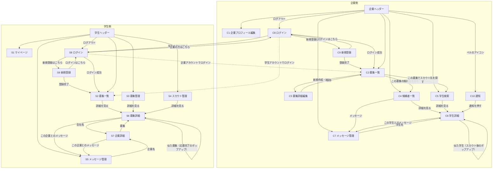

# ページ設計

> 章番号は designs/ 全体の通し番号（元の統合議事録の章番号のまま）。文中の「本書X章」「本書X-Y」は、次のファイルの該当する章を指す。
>
> - 0章（位置づけ・用語）、2章、4章、12章：[サービス概要_コンセプト.md](サービス概要_コンセプト.md)
> - 1章、事前調査、15章：[前提_調査まとめ.md](前提_調査まとめ.md)
> - 3章、9章：[技術構成.md](技術構成.md)
> - 5章、13章、0-1（AIへの依頼方針）：[その他決め事.md](その他決め事.md)
> - 6章：[ページ設計.md](ページ設計.md)
> - 7章：[処理設計_類似度.md](処理設計_類似度.md)
> - 8章：[データベース.md](データベース.md)
> - 10章、11章、14章：[未決内容.md](未決内容.md)
> - 16章：[API設計.md](API設計.md)
> - 17章：[権限_バリデーション.md](権限_バリデーション.md)
> - 18章：[開発環境.md](開発環境.md)

## 6. ページ構成

### 6-1. 画面一覧（19画面）と入口・操作

各画面の URL は本書16-1-13。

- このほかに、**振り分けだけを行う `/` がある**。ログイン中なら種別ごとのホーム（C2・S2）へ、未ログインなら学生のログイン画面（S8）へ移すだけで、中身のあるページではない。サービス紹介のページは作らないので、画面としては数えない（本書16-1-6）

企業側（10画面）

- C1 企業プロフィール編集｜入口：会社情報タブ｜操作：保存
- C2 募集一覧（企業のホーム）｜入口：募集管理タブ、C8（ログイン成功）、C9（登録完了）｜操作：新規作成・編集 → C3／この募集の候補者を見る → C4（募集で絞り込み）／この募集でスカウト先を探す → C5（募集条件で絞り込み）
- C3 募集詳細編集｜入口：C2｜操作：保存 → C2
- C4 候補者一覧｜入口：候補者管理タブ、C2｜操作：詳細を見る → C6／メッセージ（マッチ以降のみ）→ C7
- C5 学生検索｜入口：学生検索タブ、C2｜操作：詳細を見る → C6
- C6 学生詳細｜入口：C4、C5、C7、C10、C6（スカウト後のポップアップ）｜操作：募集の選択欄（自社の全募集）で選んだ募集ごとに、状態に応じたボタン／この学生とのメッセージ（選択欄の外）→ C7／ポップアップの学生 → その学生の C6
- C7 メッセージ管理｜入口：メッセージタブ、C4、C6｜操作：送受信、学生名 → C6
- C8 ログイン（企業用）｜入口：未ログイン時、C9、S8、ログアウト｜操作：成功 → 元々開こうとしていたページ、なければ C2
- C9 新規登録（企業用）｜入口：C8｜操作：登録完了 → C2
- C10 通知｜入口：ヘッダーのベルのアイコン｜操作：通知を押す → C6／すべて既読にする

学生側（9画面）

- S1 マイページ（学生プロフィール編集）｜入口：マイページタブ｜操作：保存
- S2 募集一覧（学生のホーム）｜入口：募集検索タブ、S8（ログイン成功）、S9（登録完了）｜操作：詳細を見る → S6
- S3 募集管理｜入口：募集管理タブ｜操作：詳細を見る → S6
- S4 スカウト管理｜入口：スカウト管理タブ｜操作：詳細を見る → S6
- S5 メッセージ管理｜入口：メッセージタブ、S6、S7｜操作：送受信、届いているスカウトにマッチ（PR222）、企業名 → S7
- S6 募集詳細｜入口：S2、S3、S4、S7、S6（応募完了のポップアップ）｜操作：応募、マッチ、メッセージへ → S5、会社名 → S7、ポップアップの募集 → その募集の S6
- S7 企業詳細｜入口：S5、S6｜操作：募集 → S6／この企業とのメッセージ（スレッドがあるとき）→ S5
- S8 ログイン（学生用）｜入口：未ログイン時、S9、C8、ログアウト｜操作：成功 → 元々開こうとしていたページ、なければ S2
- S9 新規登録（学生用）｜入口：S8｜操作：登録完了 → S2

### 6-2. タブの役割（ヘッダー）

企業側

- 会社情報：学生に見せる自社情報を整える → C1
- 募集管理：募集の作成・編集と、募集を起点にした「候補者確認」「スカウト先探し」への入口 → C2
- 候補者管理：応募・スカウト・マッチ済みの相手を、横断（すべて）または募集別に整理する → C4
- 学生検索：まだ関係のない学生を探してスカウトする → C5
- メッセージ：スカウトした学生・マッチした学生との会話（企業×学生で1本）→ C7
- ベルのアイコン：「おすすめの学生」の通知。未読があれば件数を表示する（10件以上は「9+」）→ C10
  - 今は見た目を最小限にしているので、ベルの絵ではなく「通知（3）」のような文字で出している（見た目を整えるときにベルの絵にする）
- ログアウト

学生側

- マイページ：企業に見せる自分のプロフィールと稼働条件を作る → S1
- 募集検索：掲載中の募集を探す → S2
- 募集管理：応募した募集・マッチした募集を管理する → S3
- スカウト管理：届いたスカウトのうち、まだマッチしていないものを管理する → S4
- メッセージ：スカウトを受けた企業・マッチした企業との会話（企業×学生で1本）→ S5
- ログアウト

### 6-3. 画面遷移図

- Mermaid（マーメイド）形式で記述
- ヘッダーのタブは、どの画面からでも移動できるため、「ヘッダー」という1つの箱にまとめている

- 確認結果：行き止まりの画面や、どこからも入れない画面はない
- 作らないと決めた導線
  - S4 → S5 の直接導線：スカウト文は S6（募集詳細）を開き、そこの「この企業とのメッセージ」から読む
  - C7・S5 の上部に出す「マッチしている募集」から C6・S6 へ飛ぶ導線：名前を並べるだけにする

### 6-4. 段階タグ

タグの定義

- 【コア】課題要件の流れ（登録 → 募集 → スカウト・応募 → マッチ → メッセージ）に必要なもの。Phase 6 で最初に端から端まで通す
- 【強み】このプロダクトの主張（稼働条件の照合、学生と募集の比較の表示、推薦検索、見送りの扱い、応募理由、おすすめ）に関わるもの。コアが通った直後に入れる
- 【仕上げ】なくても流れは成立する利便性の部分。Phase 6 の後半から Phase 8
- 【後付け】Phase 7 以降（本書4-4、12章）。今回の19画面の中にはほぼ出てこない
- 各ページのタグは、6-5・6-6 の各ページの末尾に書いている。どのタグも付いていない項目は「タグ未付与」として書いている
- Phase 6 で作る順（【コア】順0〜8、【強み】順9〜15、【仕上げ】順16〜17）は本書11-2。【仕上げ】のうち、C3 の目的・求める人材と職種の判定ルールの表示、S2 のフルスタックのルール、S3 のタグでの絞り込み、C9・S9 の同意チェックと進み具合の表示は、今回の開発では作らない（議事録28。PR333）

全画面に共通

- 【コア】権限制御（他社・他人のデータを見られない、未ログイン時はログイン画面へ）
- 【コア】ヘッダーのタブとログアウト
- 【コア】アイコンの表示（人・会社が並ぶすべての画面：C4、C5、C6、C7、S2、S5、S6、S7。入力は C1・S1・C9・S9）
  - あとから足すと画面の見た目を作り直すことになるため、最初から入れる
  - API はどの画面の分でも icon_url を返すので、追加の窓口は要らない（本書16-3 形B・形C）
- 【強み】推薦の集計の更新処理（裏側のジョブ。本書7-5）
- 入力画面の必須の示し方（C1・C3・C9・S1・S9。順8 でそろえた。PR231）
  - 必須の項目名のすぐ右に赤い「＊」を付ける。画面の読み上げには「＊」ではなく「（必須）」と読ませる
  - 画面の見出しの下に「＊は必須項目です」と添える
  - 条件付きの必須（C3 の「インターンですること」「時給」は、状態が掲載中のときだけ必須）は、「＊」ではなく「（掲載に必要）」の文字で示す。いつも必須の「＊」と同じ印にすると、非公開で保存できないように見えるため
  - 開閉するまとまりの見出しの一言（C3・S1）には、「（必須）」を書かない（中身の要約だけにする）
  - 部品は `components/form-fields.tsx`（RequiredMark・LabelText・RequiredNote、入力欄の部品の required）
  - 最初から値が入っていて空にできない項目（C3 のカルチャーグラフ）には「＊」を付けない（PR248）
- 画面の説明の一言は、無いと誤解や操作ミスが起きるものだけにする。見ればわかるものには足さない（順9。PR243 を取り下げたときの方針）
- 職種の入力部品（`components/job-category-picker.tsx`。C3 の職種、S1・S9 の興味のある職種、S2 と C5 の職種の条件の4か所で共通。順9）
  - 大分類の枠の上の行（PR237・PR238）
    - □ そのもの：チェックがなければ付けて開く。チェックがあれば外す（中の中分類の選択も外れる）
    - □ 以外（名前・説明・空いているところ・［⌄］）：チェックがなければ付けて開く。チェックがあれば開閉だけ（チェックは外れない）
    - 開閉のつもりで名前を押して、選んだものが消えることがないようにするため。名前は□のラベルにしない（読み上げ用に、□に大分類の名前を結び付ける）。［⌄］はキーボードで開閉するために残す
  - C3 だけ、チェックを入れた中分類の横に「メイン｜サブ」を出す（6-5 C3。PR234）
- 5軸のスライダー（`components/culture-axes-field.tsx`。S1・S9 の働き方の好み、C3 のカルチャーグラフで共通。順9）
  - 各軸：軸の名前、両端の短い名前（「スピード」「緻密さ」）、スライダー、両端の長い説明。文言は ⑦ の culture_axes から出し、画面側に書かない
  - スライダーは5段階（−2〜2）。5つの点に目盛りの丸を置き、目盛りを押すとその段に動く。つまみは目盛りより一回り大きい丸
  - 真ん中からつまみまでの間に、薄いオレンジの線を出す（色は `app/globals.css` の変数 `--highlight`。PR245）。左右どちらに寄せても同じ色で、どちらが良いとは見せない。左端から塗る形（量のように見える形）にはしない
  - 読み上げには、位置を「スピード」「ややスピード」「こだわらない」「やや緻密さ」「緻密さ」のように読ませる
  - 部品は shadcn/ui のスライダーではなく、中身の Base UI のスライダーを直接組み立てる（棒の中に目盛りと線を入れるため。PR244）
  - 見るだけのグラフ（S6・C6 のカルチャー）は、同じファイルの `CultureAxesView`。目盛りと線は入力と同じ
    - 各軸の並びは「軸の名前 → 両端の長い説明 → 線と点」。両端の短い名前は出さない（軸の名前・短い名前・長い説明が並ぶとくどいため。順10 で開発者の指示）。入力のスライダーは、段を選ぶ目印として短い名前を残し、説明は線の下のまま
    - 点が1つのとき：値の位置に濃い点と、真ん中からの薄いオレンジの線
    - 2つの点を比べるとき（S6 の自分の働き方の好み、C6 の学生と募集。PR256・PR258）：募集の値に白丸（大きめの枠線だけ）、学生の値に黒丸（小さめの塗りつぶし）を置き、2点の間に薄いオレンジの線を引く（PR259）。大きさを変えてあるので、同じ位置では「白丸の中に黒丸」の形になり、どちらの点も隠れない。上に凡例を1行だけ出す（S6「● あなた　○ この募集」、C6「● 学生　○ 募集」）
    - 「近い・遠い」「一致・ずれ」の判定や背景の強調はしない（PR258・PR259）
    - 読み上げには、軸ごとに「この募集：ややスピード、あなた：緻密さ」のように1文で読ませる
- 【仕上げ】一覧のページ分け、N+1問題の対策の点検（Phase 8 の重さの点検で確認）
  - S2 の募集一覧のページ分けは、順4 で前倒しして作った。返事の形（本書16-1-11）が決まっていて、合致・合致外の区切りがページをまたぐため、ページ分けと一緒でないと確かめられないため。ページ分けの部品は本書16-1-14
  - S3 の募集管理と C4 の候補者一覧のページ分けも、順5 で窓口と画面を作るときに一緒に作った。部品とページ送りが順4 でそろっていて、数行で済むため。ほかの一覧も、その画面を作る順で一緒に作る

### 6-5. 各ページの詳細：企業側

- **C1 企業プロフィール編集**
  - 役割
    - 学生に見せる自社情報を整える。登録後の編集画面
    - ここで書いた内容は企業詳細（S7）に表示され、募集の「どんな会社か」「事業内容」の既定値にもなる
  - 表示（入力項目）
    - 会社名（必須）
    - 業界（任意、複数選択。本書5-8 の15個）
    - 事業形態（任意、複数選択。本書5-8 の4つ）
      - 業界・事業形態は、会社の紹介として企業詳細（S7）に表示するだけ。検索・おすすめには使わない（使うのは募集ごとの値。本書5-8）
    - 事業内容（任意、文章）
    - 人数（任意、選択：1〜9／10〜49／50〜99／100〜299／300〜999／1000以上。範囲は仮置き）
    - どんな会社か（任意、文章）
    - アイコン（任意。PNG（ピング）・JPEG（ジェイペグ）・WebP（ウェブピー）、2MB 程度まで）
  - 操作
    - 保存
  - 画面以外の決まりごと
    - 企業プロフィールの業界・事業形態は、おすすめの近さの計算に使わない。保存しても推薦の処理は動かない（本書7-5）
  - 段階タグ
    - 【コア】全項目と保存

- **C2 募集一覧**
  - 役割
    - 募集の作成・管理と、募集を起点にした候補者確認・スカウトへの入口
    - 企業のホーム。ログイン後と、新規登録の完了後の行き先
  - 表示
    - 上部に「募集新規作成」ボタン
    - 登録完了後の行き先になるため、「最初の募集を作成する」への導線を目立たせる（企業のおすすめに効く情報のほとんどが、募集ごとの項目のため）
    - 自社の全募集のリスト。各行に「編集する」「この募集の候補者を見る」「この募集でスカウト先を探す」の3つのボタン
    - 各行に、タイトル、状態、最初に掲載した日、最終更新日、未対応の応募の件数を出す。並び順は最終更新の新しい順（本書16-3 ⑪）
  - 操作
    - 募集新規作成 → C3（空の状態）
    - 編集する → C3（その募集）
    - この募集の候補者を見る → C4（その募集のタブを選択した状態）
    - この募集でスカウト先を探す → C5（その募集を選択した状態。並び順は「○○」におすすめ順。条件は入れない。PR303）
      - 条件を入れたい企業は、C5 の稼働条件のポップアップの「この募集の稼働条件で選ぶ」で入れる（PR302）
  - 段階タグ
    - 【コア】自社の募集リスト（行のタイトル・状態・最初に掲載した日・最終更新日を含む）、新規作成、編集、「この募集の候補者を見る」
    - 【強み】「この募集でスカウト先を探す」（C5 の推薦検索につながる）
    - 【仕上げ】行に出す未対応の応募の件数
    - タグ未付与：「最初の募集を作成する」への導線
  - 作る順
    - 順13：「この募集でスカウト先を探す」
    - 順16：行に出す未対応の応募の件数。行の「最終更新日」の後ろに「未対応の応募：3件」と出し、1件以上なら太字にする（対応が必要な募集が一目でわかるように）。0件でも「0件」と出す

- **C3 募集詳細編集**
  - 役割
    - 募集の新規作成と編集（同じ画面を使う）
    - 募集の状態の切り替えもここで行う
  - 表示（入力項目・学生に見せるもの）
    - 募集状態（必須）：非公開／掲載中／終了。3つは自由に行き来できる（本書17-2-2）
    - 会社名（企業プロフィールから自動で表示）
    - 募集タイトル（必須）
    - 業界・事業形態（任意、それぞれ複数選択。本書5-8）：この募集の事業の分野と形。企業プロフィールの値とは別に持ち、空欄でも企業の値で補わない。検索・おすすめ・比較にはこの値を使う
      - 会社情報にも同じ欄があるので、まとまりの見出しの横の一言を「この募集の事業の分野と形」にして、この募集の値であることを伝える
    - 職種：主な中分類・関連する中分類（それぞれ複数、上限なし）。大分類 → 中分類の2段階。境界が曖昧な組み合わせの判定ルールを添える
      - **1つの一覧**で選び、チェックを入れた中分類の横に「メイン｜サブ」の切り替えを出す（メイン＝主な、サブ＝関連する）。チェックを入れた時点ではメイン（PR234・PR236）
      - 同じ中分類がメインとサブの両方に入ることは、画面の作りの上で起きない（データベースの UNIQUE と同じ形）
      - 大分類の枠の上の行の動きは、本書6-4 の「職種の入力部品」のとおり（PR237）
    - 工程：「メインで担当する工程」と「関われる工程」
      - 職種と同じく、13個を**1つの一覧**で選び、チェックを入れた工程の横に「メイン｜関われる」の切り替えを出す。チェックを入れた時点ではメイン（PR235・PR236）
      - 並びは工程マスタの表示順（上流 → 下流）に固定し、選んでも・メイン／関われるを切り替えても行は動かさない（押そうとした場所がずれないように。PR241）。職種に合わせた並べ替えはしない（PR239）
    - 募集概要
      - どんな会社か（空欄なら企業プロフィールの内容を表示）
      - 事業内容（空欄なら企業プロフィールの内容を表示）
      - インターンですること（掲載に必要）
      - 成長イメージ
    - 稼働条件：共通形式の企業側（週の稼働日数、1日の稼働時間、継続期間、開始時期、勤務形態＋補足、勤務地＋最寄り駅など、土日OK、備考）。すべて任意
      - 開始時期は「年」と「月」の2つの選択欄。両方空欄なら随時。年の選択肢は1年前〜2年後（今年は日本時間で数える）で、保存済みの年がその範囲の外なら、その年も選択肢に足す（Rails 側は範囲を制限しない。本書5-6、17-3-4）
      - 片方だけ選んで保存を押したら、「開始時期は年と月の両方を選んでください」と出して止める（画面側だけの確認。本書17-3-6）
    - 給与：時給（掲載に必要、円）
    - カルチャーグラフ（必須）：学生の働き方の好み（性格）と同じ5軸のスライダー。初期値は中央。見た目と動きは本書6-4 の「5軸のスライダー」のとおり
      - 最初から真ん中に値があって空にできないので、必須の赤い「＊」は付けない（「＊」は「入れないと保存できない」の意味で付けているため。PR248）
    - 必須要件・歓迎要件（どちらも任意）：文章
    - 使用言語・フレームワーク・技術：共通マスタから選択＋文章
  - 表示（入力項目・学生には見せないもの）
    - 目的：採用／戦力／両方
    - 採用につながる可能性：高い／あり／なし（選択肢は仮置き）
    - 求める人材
      - 学年（選択、複数可。学生プロフィールの学年と同じ選択肢）
      - 卒業年度（○年〜○年。片方だけの指定も可）
      - その他特徴（文章）
  - 操作
    - 保存 → C2
  - 画面以外の決まりごと
    - 必須は2段。募集状態・タイトル（・カルチャーグラフ）は常に必須。インターンですること・時給は「掲載に必要」で、状態が掲載中のときだけ確認する（本書5-9、17-3-3）
      - 非公開なら書きかけでも保存できる（下書きとして使う）
      - 画面では「掲載に必要」の項目に印を付け、保存を押したときに同じ条件でその場で確認する
    - 初めて掲載中にしたときに、最初に掲載した日時を記録する（新着順と、一度でも掲載したかの判定に使う）。再掲載しても更新しない
    - 保存するときに、おすすめの計算に使う項目の数（推薦の集計）も同じトランザクションで保存し直す（本書7-5）
  - 段階タグ
    - 【コア】募集状態、タイトル、募集概要（空欄なら企業プロフィールの値を表示）、稼働条件の入力、時給、必須要件・歓迎要件、使用技術、職種（大分類 → 中分類）、必須チェック
    - 【強み】工程（メイン／関われる）、業界・事業形態、カルチャーグラフ
    - 【仕上げ】目的・求める人材（学生に見せず、ロジックでも使わない項目）、境界が曖昧な職種の判定ルールの表示
      - 今回の開発では作らない（議事録28。PR333）
  - 作る順
    - 順2：【コア】。入力欄はまとまりごとに開閉する形（アコーディオン）
    - 順9：【強み】の3つ。まとまりの並びは「基本 → 業界・事業形態 → 職種 → 工程 → 募集概要 → 要件・使用技術 → 給与 → 稼働条件 → カルチャー」。工程は職種と別のまとまりにした（職種の一覧は開くと長くなるので、1つのまとまりが長くなりすぎないように。PR247）。職種の欄も1つの一覧に作り直した（PR234）

- **C4 候補者一覧**
  - 役割
    - 応募・スカウト・マッチ済みの相手を整理し、次の対応を決める
  - 表示
    - タブ：「すべて」（既定）＋募集別。C2 から来た場合はその募集のタブを選択
    - 行の単位：やりとり1件（募集×学生）＝1行
    - 未マッチの行のタグ：未対応応募／スカウト済み
    - マッチ以降の行のタグ：未返信（学生が最後に送り、企業がまだ返していない）／なし
    - 見送り・合格・不合格は既定で非表示。タブの下のチェック欄「見送り・合格・不合格も表示」を付けると表示される（PR273）
      - 隠すのは Rails（本書16-3 ㉑ の show_all）。チェックの状態は URL の ?show_all=true に持ち、タブを変えても、ページを送っても残る。付け外しすると1ページ目に戻る
      - 0件のとき：チェックなしは「対応中の候補者はいません」、チェックありは「まだ応募・スカウトはありません」（見送った行があるのに「何もない」と読めないように。PR273）
    - 各行に、学生の名前・学年・卒業年度・活動状況、募集名、状態とタグ、やりとりが始まった日を出す。並び順は、やりとりが始まった日の新しい順（本書16-3 ㉑）
  - 操作
    - 詳細を見る → C6（その募集を選んだ状態）
    - メッセージ（マッチ以降の行のみ）→ C7（その学生のスレッド）
  - 段階タグ
    - 【コア】やりとり1件＝1行のリスト、「すべて」と募集別のタブ、未対応応募／スカウト済みのタグ、詳細を見る、メッセージ
    - 【強み】見送り・合格・不合格を既定で隠し、切り替えで表示
    - 【仕上げ】未返信タグ
    - 行に出す学生情報（学年・卒業年度・活動状況）と並び順は【仕上げ】だったが、順5 で前倒しして作った。名前がないと誰の行か分からず、【コア】の段階でも画面が使えないため（PR207）
  - 作る順
    - 順5：上の【コア】（メッセージを除く）と、前倒しした学生情報・並び順。タブとページは URL の ?job_posting_id= と ?page= に持つ。学生の名前も学生詳細へのリンクにする
    - 順7：「メッセージ」のボタン。行き先の C7 を作る順7 まで待った。先に置くと、押しても「見つかりません」になるため（本書11-2。PR209）
      - 出すかは、Rails が行ごとに返す after_match（マッチ以降か）に従う。画面が状態から組み立てると、メッセージを送れるかの判定と同じ判定が2か所になるため（本書16-3 ㉑。PR224）
      - 「詳細を見る」の横に置く。押すと、その学生のスレッドを開いた C7 へ
    - 順11：見送り・合格・不合格を既定で隠す切り替え（PR273）
    - 順16：未返信タグ。状態のタグの隣に「未返信」の札を出す。出すかは Rails が行ごとに返す unreplied に従う（本書16-3 ㉑）。メッセージは相手ごとなので、同じ学生のマッチ以降の行が2つあれば両方に付く

- **C5 学生検索**
  - 役割
    - まだ関係のない学生を探してスカウトする
  - 表示
    - 検索条件
      - 募集の選択：自社の募集（掲載中以外も含む）から1つ選ぶ。選ばなくてもよい
      - 推薦検索：稼働条件のポップアップの一番上に「この募集の稼働条件で選ぶ」ボタンを置く。押すと、選んだ募集の稼働条件（入力済みの項目）で、ポップアップの中身（週の日数、1日の時間、継続期間、開始時期、勤務形態、勤務地）を置き換える。未入力の項目はオフになり、ほかの条件（技術・職種など）はそのまま。手動で調整可（PR302）
        - 募集を選んだだけでは、条件は変わらない（並び順が「○○」におすすめ順になるだけ）。募集を選んでいないときは、ボタンを押せない
        - 変わるのは下書きだけで、「検索する」を押すまで結果は変わらない
        - 並び順と条件を切り離し、押したときだけ入れる形にしたのは、自動で入れると「条件は URL が正」の決まりとぶつかり、手で外した条件が戻ってきて外せなくなる場面が出るため。本人の知らないうちに条件も変わらない
      - 募集を選ばず条件だけでも検索可
      - 検索条件の項目：フリーワード（自己PR、資格名、プログラミング歴の「その他」。名前と大学名は対象にしない）、稼働条件（週の日数、1日の時間、継続期間、開始時期、勤務形態、勤務地）、使用技術とレベル、職種、学年、卒業年度、活動状況（本書16-3 ㉒）
      - 条件欄の形は S2 と同じく、ボタンとポップアップ：［稼働条件］［技術］［職種］［学年・卒業年度・活動状況］（フリーワード）［検索する］。S2 の条件欄の部品を使い回す。「検索する」を押すまでは結果を変えない
        - 稼働条件：週◯日以上、1日◯時間以上、◯ヶ月以上、開始時期、勤務形態（1つだけ）、勤務地（1つだけ。勤務形態がフルリモートのときは使わない）
        - 技術：技術を選び（選んだ技術をすべて持っている学生が合う）、レベルを「◯以上」で選べる
        - 卒業年度の選択肢は、今年から10年後まで
      - 選んだ募集・条件・並び順・ページは、URL の `?` の後ろに持つ（本書16-1-13）。画面は URL を読み取った内容から作り直して Rails に渡す（「募集を選ばずにおすすめ順」のような URL を手で書かれても 422 にしないため）
    - 並び順
      - タブで切り替える：「「○○」におすすめ順」と「最終活動が新しい順」
      - 「○○募集におすすめ順」：企業が自社の募集を1つ選ぶと、f(募集, 学生) の高い順に並ぶ（本書7章）。群ごとに上位100人まで。101人目以降は最終活動が新しい順（本書7-5。PR280）。募集を選んでいないときは押せない
      - おすすめ順以外の並び順は、最終活動が新しい順。募集を選んでいないときは、こちらが既定
    - 結果：学生のリスト
      - **条件で結果を減らさない。** 条件を全部満たす学生を上、1つでも外れる学生を下に並べ、境目に「ここから条件に合いません」の区切りを出す（本書7-3）
      - 件数は「条件に合う◯人／全◯人」の2つを出す
      - 条件に合う人が0人のときは、区切りが先頭に来る
      - 募集を選んだときは、その募集とのやりとりの状態をタグで出す。下の除外のあとなので、出るのは「未対応応募」だけ。選んでいないときは、自社のどれかの募集とやりとりがあれば「やりとりあり」
      - 各学生の最終活動の目安（3日以内／7日以内／30日以内）
  - 操作
    - 詳細を見る → C6
  - 画面以外の決まりごと
    - 最終活動日が30日より前の学生は、検索対象から**除外**する（おすすめ順以外の並び順でも同じ）。最終活動日が空の学生も外し、ちょうど30日前の学生は出す（PR216）。これは利用者が指定した条件ではないため、2群に分けるのではなく外す（本書7-3）
    - もうスカウトした・見送った・マッチした学生も、検索対象から**除外**する（PR220）。検索はスカウトする相手を探すためのもので、残しても邪魔になり、おすすめ順にも既存の学生がたまるため
      - 募集を選んだとき：その募集とのやりとりが、スカウト済み、見送り（応募・スカウトとも）、マッチ以降（マッチ・合格・不合格）の学生を外す。未対応応募は残す
      - 募集を選んでいないとき：自社の掲載中の募集すべてと、上のどれかのやりとりがある学生を外す。掲載中の募集が1件もなければ、誰も外さない
      - 外すのは Rails で行い、人数とページ分けも外したあとの学生で数える（本書16-3 ㉒）。外した学生は、C4 から C6 を開ける
    - 活動状況が「今は探していない」の学生は、結果から外さない
    - 条件を指定した項目が未入力の学生は、合致外の群に入れる（結果には出る。本書5-10）
    - 並び順に関係なく、いつも2群に分ける（本書7-3）
  - 段階タグ
    - 【コア】学生のリスト、基本的な条件検索、詳細を見る
    - 【強み】推薦検索（「この募集の稼働条件で選ぶ」）、「○○募集におすすめ順」
    - 【仕上げ】最終活動の目安の表示
    - タグ未付与：30日以上活動のない学生の除外、スカウト済み・見送り・マッチ以降の学生の除外（PR220）
    - やりとりのタグは【仕上げ】だったが、順6 で前倒しした（PR219）
  - 作る順
    - 順6：【コア】と、除外、やりとりのタグ、募集の選択と並び順のタブ、ページ分け（URL の ?page=）。おすすめ順は、通り道と仮の点数（全員0点）で作った（S2 と同じやり方。PR214）
    - 順13：おすすめ順の本物の計算（本書7-5。PR295）、推薦検索（PR294・PR302）
    - 順16：最終活動の目安。行の「学年・卒業年度・活動状況」の後ろに「最終活動：3日以内」と出す（行の部品は C6 のスカウト後のポップアップと共通なので、そちらにも出る）。表示名は Rails の⑦ から引く
    - 1人もいなければ「表示できる学生がいません」

- **C6 学生詳細**
  - 役割
    - 1人の学生を見て、募集ごとに判断・操作する
  - 表示
    - 募集の選択欄：自社の全募集（掲載中以外も含む。並びは⑪ と同じ最終更新の新しい順）。遷移元の募集を初期選択、なければ先頭
      - 大きな枠の上に「募集 [選択欄 ▼]」を置く。部品は C5 の「募集を選ぶ」と同じブラウザ標準の選択欄。募集名は長く、タブで横に並べると折り返すため（PR267）
      - 非公開・終了の募集は、選択肢の名前の後ろに「（非公開）」「（終了）」を付ける。掲載中は付けない。ボタンが出ない理由がわかるように（PR268）
      - 選び直すと URL の ?job_posting_id= を書き換える。ブラウザの「戻る」の履歴には積まない
    - 選んだ募集の中身：その募集での状態・ボタン、応募理由・マッチ理由、学生と募集の比較、学生のプロフィール（マッチ前でもすべて見せる）
    - 見た目：大きな枠の中に、上から、その募集での状態（タグ・マッチした日）とボタン、応募理由・マッチ理由、区切り線、比較、区切り線、学生のプロフィールを入れる。募集名と募集の状態は選択欄に出ているので、枠の中では繰り返さない（PR268）。プロフィールの項目ごとの小さな枠は開け閉めしない
    - 応募理由・マッチ理由（PR255）
      - 理由があるときだけ出す（応募したとき、スカウトに学生がマッチしたときに付く。応募のあと見送り・合格・不合格になっても残る）。見出しは、応募から始まったやりとりは「応募理由」、スカウトから始まったものは「マッチ理由」
      - 12個すべてを画面に出す順で並べ、選んだ理由は ✓ を付けて濃く、選んでいない理由は薄く出す。押せるチェック欄にはしない（見るだけのため。押せない欄は灰色で読みにくい）。読み上げには選んだ理由だけを読ませる
    - 比較の見せ方（PR256）
      - 左に学生、右に募集を並べる。いちばん上に列の見出し「学生」「この募集」（まとまりの見出し「この募集との比較」は画面に出さず、読み上げにだけ残す）
      - 業界（学生の興味のある業界と募集の業界）、職種（学生の興味のある職種と、募集のメイン＋サブの職種）、使用技術（学生のプログラミング歴と募集の使用技術）：名前を小さな札で並べ、両方にあるものは左右とも札をオレンジの枠にして「一致」の文字を添える（色だけに頼らない）。プログラミング歴の「その他」の行は、番号がないので一致にならない
      - 稼働条件：週の稼働日数・1日の稼働時間・継続期間・開始時期・勤務形態・勤務地の6行。学生の値はプロフィールと同じ書き方（「週3日まで」）、募集の値は募集詳細と同じ書き方（「週3日以上」）。一致した行はオレンジの枠と「一致」、合わない行は「不一致」、判定できない行は何も付けない。勤務地の募集の値は、フルリモートなら「問わない（フルリモート）」
      - カルチャー5軸：1本の線に学生（黒丸）と募集（白丸）を重ね、2点の間を薄いオレンジの線で結ぶ（本書6-4 の見るだけのグラフ）。背景の強調はしない（PR259）
      - どちらかが未入力の項目は判定せず、空の側に「未入力」と出す。勤務地は、学生の出社できる都道府県が空なら、不一致ではなく未入力（PR257）
      - 一致・不一致の判定は Rails が返す（本書16-3 ㉓）。画面側では比べない
      - 合計点（おすすめ度）は表示しない
    - 見出しの大きさ：「応募理由」「マッチ理由」と列の見出し「学生」「この募集」は、プロフィールのまとまりの見出し（「基本情報」など）と同じ大きさ。「業界」「職種」「使用技術」「稼働条件」「カルチャー」はそれより一段小さい太字
    - 学生の最終活動の目安
  - 操作（その募集での状態ごと）
    - 関係なし
      - 掲載中：「スカウトをする」→ ポップアップで文面入力（PR212）→ 送信 → スカウト済みになる。文面は C7 のスレッドの最初のメッセージになる。送信後に「この学生に似た学生」のポップアップを出す
        - 文面のポップアップは、応募理由のポップアップと同じ部品で、選んだ募集を開いたまま送れる。「あと◯文字」を出す。空なら送らずに「スカウト文を入力してください」と出す（Rails と同じ文言。本書17-3-3）
        - 送れなかったとき（409 など）は、ポップアップを閉じて一言を出し、学生詳細を取り直して最新の状態にする（本書16-1-10）
      - 掲載中以外：ボタンなし
    - 未マッチ（応募）
      - 掲載中：「マッチする」→ 確認のポップアップ（「○○さんとマッチしますか？」。マッチは取り消せないことを添える）→ マッチ／「見送る」→ 確認 → 見送り
        - マッチに確認を挟むのは、マッチ以降は未マッチ・見送りに戻せず（本書17-2-1）、押し間違いを取り消せないため（PR210）。見送り（応募由来）からの「マッチする」も同じ
      - 掲載中以外：「見送る」のみ
    - 未マッチ（スカウト）
      - 「スカウト済み」と表示＋「見送る」（募集の状態に関係なく同じ）
    - マッチ
      - 「合格として保存」「不合格として保存」（募集の状態に関係なく同じ）
    - 見送り（応募由来）
      - 「見送りを取り消す」→ 未対応応募に戻る（募集の状態に関係なく同じ）
      - 掲載中なら、加えて「マッチする」→ マッチ
    - 見送り（スカウト由来）
      - 「見送りを取り消す」→ スカウト済みに戻る（募集の状態に関係なく同じ）
      - 見送り中に学生が応じた場合は、マッチとして再表示される
      - ※「スカウトは学生が応じたときにマッチ」という方針と整合させるため、企業側に「マッチする」は出さない
    - 合格・不合格
      - 合格なら「不合格として保存」、不合格なら「合格として保存」で付け替える（募集の状態に関係なく同じ）
    - やりとりを変えるボタン（マッチする・見送る・見送りを取り消す・合格として保存・不合格として保存）は、**すべて確認のポップアップを挟む**（順11 で開発者の指示）
      - 見出しは「○○さんを見送りますか？」のような問いかけ。説明に募集名を入れる。見送り・合格・不合格は「学生には知らされません」と添える（学生に見せない決まりのため。本書5-1）。見送りは「あとで取り消せます」、マッチは「マッチは取り消せません」と添える
      - 「マッチする」だけ塗りつぶしのボタン、ほかは枠線だけのボタン。横に並べ、狭い画面では折り返す
      - 送れなかったとき（409 など）は、スカウトと同じく、ポップアップを閉じて一言を出し、学生詳細を取り直す
  - 操作（募集の選択欄の外。学生ごと）
    - 「この学生とのメッセージ」→ C7
      - **その学生とのスレッドがあるときに出す**（本書17-2-3）。スレッドができるのは、スカウトを送ったときか、応募がマッチしたとき
      - どの募集を選んでいても同じように出る。メッセージは「募集ごと」ではなく「相手ごと」のため
      - 送れるかどうか（マッチ以降が1つでもあるか）は C7 の入力欄が決める。まだ返信のないスカウトでも、自分が送った文面を読みに行ける
  - スカウト送信後のポップアップ
    - スカウトが送れたら、表示を「スカウト済み」に書き換えてから開く。題名は「スカウトを送りました」、その下に小見出し「この学生に似た学生」と一覧（PR320）
    - 「この学生に似た学生」を5人表示する（f(学生, 学生) の上位5人）
    - 30日以上活動のない学生と、その募集とやりとりがある学生は除外する
    - スカウトに使った募集の稼働条件に**合う学生を優先**し、5人に満たなければ合わない学生からも補充する（本書7-3）。それでも足りなければ、ある分だけ表示する。「合う」は、C5 の「この募集の稼働条件で選ぶ」と同じ条件（PR313）
    - 1人の行は、C5 の学生検索の行と同じ部品（名前、学年・卒業年度・活動状況、興味のある職種、プログラミング歴、稼働条件、「詳細を見る」。PR319）。スカウトするかを決めるための情報がそのまま役に立ち、見た目もそろうため
      - 5人並べると縦に長くなるので、ポップアップの中の一覧だけを縦にスクロールできるようにする
      - 合う・合わないの区切りは出さない
    - 各学生を押すと、その学生の C6 へ、スカウトに使った募集を選んだ状態（`?job_posting_id=`）で移動する（続けて同じ募集でスカウトしやすいように。PR315）。移る前にポップアップを閉じる
    - 似た学生が0人（候補そのものがいない）なら、小見出しと一覧を出さず、題名と「閉じる」だけにする。「いません」の一言は足さない（PR320。見ればわかるものに説明を足さない方針）
    - 取ってくる間は、一覧の場所に「読み込み中…」を出す
    - 「スカウトをする」のボタンは送ったあと消えるので、ポップアップはスカウトのポップアップの外に置く
  - 画面以外の決まりごと
    - スカウト送信は、やりとり・スレッド（まだなければ）・メッセージ・スカウトメッセージを1つのトランザクションで作る（本書9-2）
    - 応募にマッチするときは、やりとりの更新と、スレッドの作成（まだなければ）を1つのトランザクションで行う
    - 見送り・見送りの取り消し・合格・不合格は、やりとりの状態を変えるだけで、通知や推薦の更新は起こさない（通知のきっかけは、学生が応募したときとスカウトに応じてマッチしたとき。本書6-5 C10。PR272）
    - 選んだ募集の中のボタンは、API が返す「今押せる操作」（available_actions）に従う。選択欄の外のメッセージのボタンは has_message_thread に従う（本書16-3 ㉓）
    - スカウト・マッチ・見送りなどのあとは、返ってきた「その募集の状態」（形D）を、元の中身に重ねて書き換える。返事には比較が入っていないので、丸ごと置き換えると比較が消えるため（比較はこれらの操作では変わらない）
  - 段階タグ
    - 【コア】学生プロフィールの表示、募集の選択、「スカウトをする」（文面入力 → 送信）、「マッチする」、「この学生とのメッセージ」、掲載中以外の募集でボタンを出さない制御
    - 【強み】比較の表示（業界・職種・使用技術・稼働条件の一致・不一致、カルチャー5軸の2点）、応募理由・マッチ理由の一覧、見送る・見送りを取り消す、合格・不合格の保存と付け替え、スカウト送信後のポップアップ
    - 【仕上げ】最終活動の目安の表示
  - 作る順
    - 順5：学生プロフィールの表示（マイページの項目を読むだけの形で並べる）、募集タブ（タブの切り替えは URL の ?job_posting_id= を書き換える。ブラウザの「戻る」の履歴には積まない）、その募集での状態（タグ）とマッチした日、「マッチする」と確認のポップアップ
    - 順6：「スカウトをする」と文面のポップアップ、見た目の変更（PR217）
    - 順7：「この学生とのメッセージ」。has_message_thread は順6 で Rails が返し、ボタンは行き先の C7 ができた順7 で足した（C4 の「メッセージ」と同じ理由。PR213）。学生の名前の行の右端（募集の選択欄の外）に置く
    - 順10：応募理由・マッチ理由の一覧、比較の表示、募集タブを選択欄に変えたこと（PR267・PR268）
    - 順11：見送る・見送りを取り消す・合格・不合格と、すべてのボタンの確認のポップアップ（「マッチする」の確認の部品を、5つのボタンで使い回す形に作り直した）
    - 順14：スカウト送信後のポップアップ。学生の行を C5 から切り出して使い回す部品にした（`components/company-student-row.tsx`）
    - 順16：最終活動の目安。名前の下に「最終活動：7日以内」と出す。C6 だけ「30日より前」も出る。一度もログインしていない学生（最終活動日が空）には出さない（PR335。本書16-3 ㉓）
  - 未決：企業が応募にマッチするときにも、学生に対する「マッチ理由」を選ばせるか（本書10-3）

- **C7 メッセージ管理**
  - 役割
    - スカウトした学生・マッチした学生との会話。面談日程調整の案内（外部フォームの URL など）を送るまでが主な用途
  - 表示
    - 1つの画面に、スレッド一覧とチャットを並べる。広い画面では左右（左が一覧）、狭い画面では上下
    - スレッド一覧：企業×学生で1本。スカウトした学生とマッチした学生。最後のメッセージの日時で並べる（メッセージがまだないスレッドは、作った日時で比べる。PR221）
      - 1行 = アイコン・学生の名前・最後のメッセージの日時（なければ「メッセージはまだありません」）。開いているスレッドの行は色を変える
      - 20件ずつのページ分け
    - チャット：選んだスレッドのメッセージ。スカウト文が最初のメッセージ。どの募集のスカウトかも表示できる。上部にその学生とマッチしている募集を表示
      - 自分のメッセージは右、相手のメッセージは左に寄せる。日時は「2026/09/22 10:00」の形
      - スカウト文には「募集「◯◯」のスカウト」の札を付ける
      - 相手を選んでいなければ「一覧から相手を選んでください」
    - 学生のアイコン（アイコンを必ず表示する画面）や名前：押すと C6 へ
  - 操作
    - 送信 → 学生に届く（その学生と1つもマッチしていない間は送れない）
      - 送れない間は、入力欄と「送信する」を使えなくし、「この学生とマッチすると、メッセージを送れるようになります」と出す（判定は Rails の can_send）
      - 送ったメッセージは、返事をそのまま会話の末尾に足し、スレッド一覧を取り直す
      - 空のまま送ろうとしたら、送らずに「本文を入力してください」（Rails と同じ文言）
    - C4・C6 から来た場合は、その学生のスレッドを開いた状態で表示
    - 開いている相手とページは、URL の ?student_id= と ?page= に持つ（本書16-1-13）
  - 画面以外の決まりごと
    - リアルタイム更新はしない。画面を開いたとき・再読み込みしたときに最新を取る
    - 上部の「マッチしている募集」は名前を並べるだけにし、そこから C6 へ飛ぶ導線は作らない
    - 中身は S5 と同じ部品（`components/message-center.tsx`）で、相手の種類と窓口の住所だけを差し替える
  - 段階タグ
    - 【コア】スレッド一覧、チャット、送信、スカウト文を最初のメッセージとして表示、マッチしていない間は送れない制御、C4・C6 から来たときにそのスレッドを開く
    - 【仕上げ】上部にマッチしている募集を表示、学生名から C6 へ
  - 作る順
    - 順7：【コア】と、スレッド一覧のページ分け
    - 順16：【仕上げ】の2つ（S5 と同じ部品で一緒に作った）
      - チャットの上の相手のアイコンと名前を1つのリンクにし、押すと C6 へ（募集は指定しないので、C6 は先頭の募集を選ぶ）。スレッド一覧の行は、今までどおり「そのスレッドを開く」リンクのまま
      - その下に「マッチしている募集：A、B」と、名前を「、」でつないで出す（マッチした日の古い順。Rails が並べる）。1つもなければ（スカウトの返事待ち）行ごと出さない

- **C8 ログイン（企業用）**
  - 役割
    - 企業アカウントでサービスに入る
  - 表示
    - 入力欄：メールアドレス、パスワード
    - 「ログイン」ボタン
    - 「新規登録はこちら」リンク → C9
    - 「学生の方はこちら」リンク → S8
  - 操作
    - ログイン成功 → 元々開こうとしていたページ、なければ C2
    - ログイン失敗 → 同じ画面に「ログインができません」とだけ表示する。どちらが違うか、メールアドレスが登録済みかどうかは出さない（本書17-3-1）
  - 画面以外の決まりごと
    - 認証処理は企業・学生で共通。ログイン後に種別で行き先を振り分ける（学生アカウントでこの画面からログインした場合は、学生のホーム（S2）へ）
    - ログイン済みの状態でこの画面を開いた場合は、種別ごとのホーム（企業は C2、学生は S2）へ移動する（本書16-1-6）
    - ログインしていない状態で企業用の各ページを開いた場合は、この画面へ移動する。開こうとしていたページを覚えておき、ログイン後にそこへ戻す（本書16-1-6）
    - 認証方式は Cookie＋セッション、CSRF 対策あり（本書3-1）
    - ログアウトは画面ではなく、ログイン後のヘッダーに置く
  - 段階タグ
    - 【コア】入力欄、ログインボタン、失敗時の共通エラー文言、成功時に C2 へ、学生アカウントなら学生のホームへ、「新規登録はこちら」「学生の方はこちら」のリンク
    - 【仕上げ】元々開こうとしていたページへ戻る、ログイン済みで開いたら種別ごとのホームへ移動、ログインの回数制限

- **C9 新規登録（企業用）**
  - 役割
    - 企業アカウントを作る。ステップ形式で会社情報まで聞き、全ステップの入力が終わった時点でアカウントを作る
  - 表示
    - ステップ1 アカウント：メールアドレス、パスワード、パスワード（確認）、会社名、利用規約・プライバシーポリシーへの同意チェック（おすすめへの影響：―）
    - ステップ2 会社情報：業界、事業形態、人数、事業内容、どんな会社か、アイコン（おすすめへの影響：―。業界・事業形態は会社の紹介として表示するだけ。本書5-8）
    - 各ステップの上部に進み具合（例：1／2）を表示する
    - 各ステップに見出し（「アカウント」「会社情報」）を出す
    - おすすめに効く項目には「入力するとおすすめの精度が上がります」と一言添える
    - 必須の項目名の横に赤い「＊」、画面の上に「＊は必須項目です」（本書6-4。PR231）
    - ボタン：ステップ1は「次へ」、最後のステップ（会社情報）は「戻る」「登録する」
      - 「あとで入力する」は作らない（PR228・PR230）。会社情報はすべて任意なので、見出しの下に「空欄のままでも登録できます。あとで会社情報から入力できます」と添える
    - 「すでにアカウントをお持ちの方はこちら」リンク → C8
  - 操作
    - ステップ1から進むとき：その場の確認（空欄、パスワードの長さ、確認用との一致）のあと、メールアドレスの重複を確認する（④。全部入力した後にやり直しにならないように）
    - 戻る：入力は消さずに前のステップへ
    - 登録成功 → 自動でログインし、C2 へ（最初の募集の作成へ誘導する）。ブラウザの「戻る」で登録の画面には戻らない
    - 登録失敗 → 誤りのある項目を含む最初のステップに戻して、項目ごとのエラー表示（メールアドレスが登録済み、パスワードが短い、確認用と一致しない、など。本書17-3-1）
  - 画面以外の決まりごと
    - 全ステップの入力を画面側で保持し、最後の「登録する」で、ログイン情報（種別＝企業）、企業プロフィール、付属情報（業界・事業形態）を1つのトランザクションでまとめて作る
    - アイコンは、登録が成功した直後に別の窓口で送る。失敗しても登録は取り消さない（本書16-3 ⑤）
      - 失敗したときは、すぐにホームへ移らず、「登録が完了しました。」「アイコンを保存できませんでした。あとで会社情報から登録してください」と［募集一覧へ進む］を出し、利用者が押して進む（すぐに移ると、一言を読む前に消えるため。PR229）
    - 途中でやめた人のデータはデータベースに残らない。途中で再読み込みやブラウザを閉じると、入力は消える
    - データベースの必須項目は変えない（本書5-9）。必須はステップ1だけ（学生はステップ2の活動状況も）。それ以外の項目は空欄のまま「次へ」「登録する」で進める（本書17-3-5）
    - 「次へ」「登録する」のボタンは押せなくせず、押したときに足りない項目や形式の誤りを示して進まない（本書17-3-2・17-3-5）
    - 会社情報の欄は、C1 と同じ部品（`components/company-info-fields.tsx`）。ステップ1の欄とメールアドレスの確認、画面の外枠は S9 と共通の部品
    - 企業のおすすめに効く情報（職種、工程、業界、技術、カルチャー）は、すべて募集ごとの項目なので、登録後に募集の作成へ誘導する
    - パスワードは Rails 標準の仕組み（has_secure_password）で暗号化して保存する
  - 段階タグ
    - 【コア】ステップ形式の登録、入力欄、登録ボタン、項目ごとのエラー、登録後に自動でログインして C2 へ
    - 【仕上げ】利用規約・プライバシーポリシーの同意チェック（文面はダミー）、登録ステップの進み具合の表示
      - 今回の開発では作らない（議事録28。PR333）
    - タグ未付与：おすすめに効く項目への一言
  - 作る順
    - 順8：【コア】とステップの見出し。同意のチェックと進み具合の表示は【仕上げ】（今回の開発では作らない）

- **C10 通知**
  - 役割
    - 自社に届いた「おすすめの学生」を一覧で確認し、学生詳細へ移動するための画面
  - 入口
    - ヘッダーのベルのアイコン。未読があれば件数を表示する（10件以上は「9+」など）
  - 表示
    - 自社宛ての通知を新しい順に、20件ずつ並べる（同じ時刻なら番号の大きい順）
    - 各行には、本文と日時を表示する
      - 日時の書き分け（PR325）：1分未満「たった今」、1時間未満「12分前」、24時間未満「3時間前」、それより前は今年なら「9月20日」、去年以前なら「2025年9月20日」。日本時間で数える
      - 表示は開いた時点のままで、開いている間には変わらない（未読件数をリアルタイムで更新しないのと同じ割り切り）
    - 未読の行は、背景色と丸い未読マークで区別し、本文を太字にする。画面の読み上げ用に「未読：」の文字も入れる（画面には出さない）
    - 通知が1件もないときは「通知はありません」、範囲外のページでは「このページに通知はありません」と表示する
    - 件数が多いときはページ分けする（ページ送りは他の一覧と同じ部品）
  - 操作
    - 行全体が1つのボタン。押すと、未読ならその通知を既読にして（㊸）、リンク先（C6 学生詳細）へ移動する
      - 既読にする送信に失敗したら、画面を移らずに、一覧の上に Rails の一言を出す
      - 送信中は、ほかの行とボタンを押せなくする（二度押しを防ぐ）
      - リンク先がないとき（企業の画面のパスでないとき）は、既読にするだけで移動しない
    - 「すべて既読にする」ボタン（㊹）。見出しの右に置く。未読が0件のときは押せない
      - 押したあと、一覧とヘッダーの未読件数を取り直す（画面を移らないため）
  - 通知が作られるとき
    - 学生Sが募集Pに応募したとき、または募集Pのスカウトに応じてマッチしたとき（学生が動いたとき）、Pに似た募集（f(募集P, 募集Pi) の上位）を持つ他社に「おすすめの学生S」を通知する（PR272）
      - 理由：学生は複数の選考を並行して受けるのが一般的で、選考は長い。見送りを待つと、通知を受ける企業は他社の選考が終わるまで順番待ちになり、学生も機会を並行して比べられない。学生がいちばん動いている時期に届けるため
      - 企業が応募にマッチしたとき、見送り・合格・不合格にしたときは、通知を作らない
    - 同じ会社の似た募集が複数あれば、1社1件にまとめ、上位5社に送る。1回の通知の中で同じ会社は1件だけ
    - 除外するもの
      - 30日以上活動のない学生、学生Sとやりとりがある募集、掲載中以外の募集
      - 募集Pの会社自身の募集（募集P以外も）。その会社は候補者管理ですでに学生Sを見ているため（PR321）
      - 学生Sの通知をもう受け取った会社。同じ学生について、同じ会社に何度も届かないようにする。期間は区切らない。外した分は次の会社で5社を埋める（PR322）
    - 稼働条件に**合う場合を優先**し、5社に満たなければ合わない場合からも補充する（本書7-3。ポップアップと同じ扱い）
      - 「合う」は、学生Sの稼働条件で候補の募集を見て判定する（S6 の応募完了のポップアップと同じ判定。PR324。理由は本書7-3）
    - 本文：「（自社の募集名）に合いそうな学生がいます」。自社の募集名は、1社1件にまとめたときの代表の募集
    - リンク先：代表の募集のタブを選んだ状態の C6 学生詳細（`/company/students/[学生の番号]?job_posting_id=[代表の募集の番号]`）
  - 画面以外の決まりごと
    - 見られるのは自社宛ての通知だけ。既読にできるのも自社の通知だけ
    - 通知は、応募・マッチのあとの推薦の処理（裏側のジョブ）で作る（本書7-5）
    - 本文に、募集Pのことや、応募・マッチがあったこと、他社での行動を書かない
    - 本文は作成時点の文言で固定する
    - リンク先を見られるかは、移動先の画面でいつもどおり権限を確認する
    - 画面側では、リンク先が企業の画面のパス（`/company/` で始まる）のときだけ移動する（外部サイトへのリンクを通知に仕込めないようにするため）。「//別のサイト」も `/` で始まり、ブラウザが外のサイトへ移ってしまうので、`/` で始まるかではなく種別の先頭で確かめる。ログインした後の行き先（return_to）と同じ確かめの関数を使う（PR326。本書16-1-6）
    - 未読件数はページを開いたときに取得する（リアルタイム更新はしない）。画面を移るたびにログイン中の人（③）を取り直すので、行を押して学生詳細へ移れば、ヘッダーの件数も新しくなる
  - 段階タグ
    - 【強み】C10 通知（画面と、通知を作る処理の全体）
  - 作る順
    - 順15：通知の表 → 通知を作る部品とジョブへの組み込み → ㊷〜㊹ と ③ の未読件数 → C10 とヘッダーの件数（本書11-2）

### 6-6. 各ページの詳細：学生側

- **S1 マイページ（学生プロフィール編集）**
  - 役割
    - 企業に見せる自分のプロフィールと稼働条件を作る。登録後の編集画面
  - 表示（入力項目）
    - 名前（必須、文章）
    - 大学名（選択）：大学マスタから選ぶ。文部科学省の学校コード一覧を元にできる。デモ用に一部だけでもよい
      - 選択肢の最後に「その他（一覧にない大学）」を置き、選ぶとその下に大学名の入力欄を出す（海外の大学など。本書8-5）
      - 「その他」を選んで大学名が空欄のまま保存を押したら、「大学名を入力してください」と出して止める（画面側だけの確認。本書17-3-6）
    - 学部・学科（選択）：大学とは切り離した共通の一覧にし、「学部 → その学部の学科」の2段階で選ぶ。中身は仮データでよい（工学部、文学部など）。各学部に「その他」を入れる
    - 学年（選択）：学部1年／学部2年／学部3年／学部4年／学部5年以上／修士1年／修士2年／博士／高専／その他
    - 在住の都道府県（選択）
    - 自己PR（文章。3つの問い）
      - 自分の強み、向いていること
      - 向いていないこと
      - この先やりたいこと、挑戦したいこと
    - プログラミング歴（複数登録できる）：言語・フレームワーク（共通マスタから選択、なければ「その他」に入力）、年数（0.5年なども入力できる）、レベル（v1〜v4 から選択）
      - 行ごとのエラーは、その行の下に出す（本書16-3 ⑯）
    - 外部リンク（複数可）：GitHub、ポートフォリオ、成果物など。URL と表示名
    - 資格（資格名を入力、複数可）
    - 就活状況：卒業年度（選択。選択肢は今年〜10年後で、保存済みの年がその範囲の外なら、その年も足す。Rails 側は範囲を制限しない。本書17-3-4）、興味のある業界（複数選択）、興味のある職種（中分類から複数選択）、就活希望エリア（都道府県、複数選択）
    - 働き方の好み（性格。企業のカルチャーグラフと同じ5軸のスライダー。初期値は中央）。画面での項目名は「働き方の好み」（PR233）。見た目と動きは本書6-4 の「5軸のスライダー」のとおり
      - 入力欄のまとまりは「就活状況」と「稼働条件」の間。見出しの横の一言は「進め方・新しさなど5つの軸」
    - 稼働条件：共通形式の学生側（週の稼働日数、1日の稼働時間、継続期間、開始時期、勤務形態（初期状態は3つとも可能）、出社できる都道府県（初期値なし。在住の都道府県から自動で選ばない）、備考）
      - 開始時期は、募集（C3）と同じく「年」と「月」の2つの選択欄。年の選択肢も同じ（1年前〜2年後に、保存済みの年を足す）。範囲の制限はなし。片方だけ選んで保存を押したら、「開始時期は年と月の両方を選んでください」と出して止める（本書5-6、17-3-6）
    - 活動状況（必須）：参加目的（今は探していない／スキルアップ目的／就活目的）
    - アイコン（任意。PNG・JPEG・WebP、2MB 程度まで）
  - 操作
    - 保存
  - 画面以外の決まりごと
    - 必須は名前と活動状況だけ（保存時にアプリで確認）
    - 入力した情報は、マッチ前でも企業にすべて見せる
    - 活動状況で「今は探していない」を選んでも、企業の学生検索からは外れない
    - 大学名、学部・学科、在住の都道府県は、おすすめの近さの計算に使わない
    - 保存するときに、おすすめの計算に使う項目の数（推薦の集計）も同じトランザクションで保存し直す（本書7-5）
    - 本番運用で学部・学科を実データにするときは、大学ごとの一覧か、「情報系／機械系」のような系統で選ぶ形に変える
  - 段階タグ
    - 【コア】名前、大学名、学部・学科、学年、在住の都道府県、自己PR、プログラミング歴（複数登録）、卒業年度、興味のある職種、稼働条件、活動状況、アイコン、保存
    - 【強み】働き方の好み（性格）の5軸（順9 で作った）
    - 【仕上げ】外部リンク（複数）、資格、就活希望エリア
    - 興味のある業界は【仕上げ】だったが、C6 の比較（業界）に使うので順10 で前倒しした（PR254）。入力欄は「就活状況」のまとまりの、卒業年度と興味のある職種の間（業界 → 職種の順。C3 と同じ。PR262）

- **S2 募集一覧**
  - 役割
    - 掲載中の募集を一覧・検索する
    - 学生のホーム。ログイン後と、新規登録の完了後の行き先
  - 表示
    - 上部に検索フィルター、下部に検索結果。掲載中の募集のうち、自分が応募した募集とマッチした募集を除いたもの（PR253。画面以外の決まりごとを参照）
    - 各行：会社名、タイトル、業界・事業形態・職種・工程（すべて募集の値）、勤務地・勤務形態、時給、稼働条件（最低継続期間、週○日〜、1日○時間〜）
      - 業界・事業形態・職種・工程は、「業界・事業形態 ／ 職種 ／ 工程」の1行にまとめる（薄い文字。職種は主な＋関連する、工程はメイン＋関われるをまとめて並べる。空のまとまりは飛ばす）。画面が文字で埋まりすぎないように、行は増やさない（PR250）
      - 行の部品は S3・S4・S7 と、S6 の応募完了のポップアップと共通なので、そちらにも同じ1行が出る
    - 表示できる募集が1件もないときは「表示できる募集はありません」（応募した募集を除くので、「掲載中の募集がない」とは限らないため。文言は仮。本書10-2）
    - 並び順
      - 既定はおすすめ順（f(募集, 学生) の高い順。本書7章）。点数が同じ募集どうしは、新着順で並べる。群ごとに上位100件まで。101件目以降は新着順（本書7-5。PR280）
      - 新着順（最初に掲載した日時が新しい順）に切り替えられる
      - プロフィールがほとんど空の学生でも分岐せず、そのままおすすめ順で出す（ほぼランダムに近い並びでもよい）
    - 検索結果の出し方
      - **条件で結果を減らさない。** 条件を全部満たす募集を上、1つでも外れる募集を下に並べ、境目に「ここから条件に合いません」の区切りを出す（本書7-3）
      - 件数は「条件に合う◯件／全◯件」の2つを出す。条件に合う募集が0件のときは、区切りが先頭に来る
      - 並び順（おすすめ順・新着順）に関係なく、いつも2群に分ける
  - 操作
    - 検索条件
      - ① フリーワード。募集詳細（S6）の画面に出る文章すべて（タイトル、募集概要の4つ、必須要件、歓迎要件、使用技術の補足、勤務形態の補足、最寄り駅など、稼働の備考）と、会社名・使用技術の名前・職種（中分類と大分類）の名前が対象。都道府県と勤務形態の名前は対象外（②③で探す）。詳しくは本書16-3 ⑱
      - ② 勤務地（フルリモートの募集は、勤務地に関係なく出る）
      - ③ 稼働条件などの特徴：週の日数、1日の時間、継続期間、開始時期、勤務形態の選択ボタンと、土日OK。ボタンの選択肢は稼働条件の共通形式（本書5-6）と同じ。学生側の言い方（「週◯日まで」「◯時間まで」「◯ヶ月以上」「◯年◯月から働ける」）で出す
        - 稼働条件のポップアップの一番上に「自分の稼働条件で選ぶ」ボタンを置く。押すと、自分のプロフィールの稼働条件（入力済みの項目）で、③のボタンを置き換える。未入力の項目はオフになる。手動で選び直せる（PR302）
          - 出社できる都道府県も稼働条件の一部なので、②の勤務地のポップアップも一緒に置き換える（ボタンの数が変わるので、選ばれたことは見てわかる。PR304）
          - 勤務形態は、3つとも可能なら選ばない（「未入力」と「すべて可能」は区別しない。本書5-6）。土日OK はプロフィールにない項目なので、今の選択のまま
          - 変わるのは下書きだけで、「検索する」を押すまで結果は変わらない
        - 並び順（おすすめ順・新着順）を変えても、条件は変わらない。おすすめ順は並び順だけを変え、条件は画面で選んだものだけを使う（PR302）
        - 開始時期で年と月の片方だけを選んで「検索する」を押したら、「開始時期は年と月の両方を選んでください」と出して止める（画面側だけの確認。本書17-3-6）
      - ④ 業界・事業形態・職種（大分類 → 中分類）・使用技術・工程
        - 業界・事業形態は、1つのボタン「業界・事業形態」にまとめ、ポップアップの中で業界と事業形態のチェックボックスを上下に並べる（C5 の「学年・卒業年度・活動状況」と同じ形）。ボタンの数は2つの合計（PR311）
        - 使用技術はマスタから選ぶ（どれか1つを使う募集が合う）。フリーワードでは拾えない表記の揺れ（「JS」と「JavaScript」など）を補うため。フリーワードでも技術の名前は探せる
        - 工程は13個から選ぶ（どれか1つを、メインか関われるに持つ募集が合う。使用技術と同じ形。PR251）。「設計から関わりたい」のように、関わりたい段階で探すため（職種から SE を外し、工程で表すことにしたため。本書5-8）
    - 条件欄の見た目と動き
      - `[勤務地] [業界・事業形態] [職種] [技術] [工程] [稼働条件] (フリーワード) [検索する]` を横に並べる（狭い画面では折り返す）。業界・事業形態の位置は、C3 のまとまりの並び（基本 → 業界・事業形態 → 職種 → 工程）に合わせた（PR311）
      - 各ボタンを押すとポップアップが開き、中で選ぶ。勤務地は47都道府県をそのまま並べ、職種・技術は開閉する行（大分類・技術の区分ごと）を出す。工程は13個を上流 → 下流の表示順でそのまま並べる
      - ボタンには選んでいる数を出す（例：「勤務地（2）」）。ポップアップの下に「この条件をクリア」「閉じる」
      - ポップアップの中で選んだものは、その場で画面の中の下書きに入る（「決定」の押し忘れで消えない）。**検索は「検索する」を押したときだけ**（ポップアップを閉じても検索しない。条件を3つ選ぶ間に3回検索が走らないように）
      - 並び順は、選んだ時点ですぐ反映する（今の条件のまま、並び順だけを変える）
      - 条件・並び順・ページは画面の URL の `?` の後ろに持つ（本書16-1-13）。ブラウザの「戻る」で、条件欄も結果も前の検索に戻る
    - ページ送り（「前へ 1 … 4 5 6 … 10 次へ」）。今の条件を残したまま、ページだけを変える
    - 詳細を見る → S6
  - 画面以外の決まりごと
    - 職種は、募集の主な中分類・関連する中分類のどれか1つが一致すればヒットする。「フロントエンド」「バックエンド」で検索したときは、フルスタックの募集も表示する
    - 業界・事業形態は、募集の値のどれか1つが一致すればヒットする。企業プロフィールの値は使わない（本書5-8）
    - 条件を指定した項目が未入力の募集は、合致外の群に入れる（結果には出る。本書5-10）
    - 除外するのは、掲載中でない募集と、自分の募集管理（S3）に載っている募集（自分が応募した募集と、マッチした募集）。どちらも利用者が指定した条件ではないため（本書7-3。PR253）
      - 企業に見送られた応募も除く（学生には「応募済み」に見えるため）
      - スカウトが届いてまだマッチしていない募集は出す（学生がまだ応えていないので、探す中で見つけて応じられるように）
  - 段階タグ
    - 【コア】掲載中の募集のリスト、行の表示（稼働条件の1行表示を含む）、フリーワード、勤務地、職種（大分類 → 中分類）、使用技術、新着順、詳細を見る
    - 【強み】おすすめ順（既定の並び順。本物の点数）、「自分の稼働条件で選ぶ」、工程の条件
    - 【仕上げ】業界・事業形態のフィルター、フロントエンド・バックエンドで検索したときにフルスタックも含めるルール
      - フルスタックのルールは、今回の開発では作らない（議事録28。PR333）
    - 順4 で前倒しして作ったもの：稼働条件のボタンの手動の選択と土日OK（【仕上げ】から）、ページ分け（全画面に共通の【仕上げ】から。6-4）、おすすめ順の並び替えの通り道（点数は仮に全件0点。本書16-3 ⑱）
    - 順9 で作ったもの：工程の条件、行の業界・事業形態・工程、応募済み・マッチ済みの募集の除外
    - 順13 で作ったもの：おすすめ順の本物の計算（本書7-5。PR295）、「自分の稼働条件で選ぶ」（PR302・PR304）、業界・事業形態のフィルター（【仕上げ】から前倒し。PR299・PR311）

- **S3 募集管理**
  - 役割
    - 自分が応募した募集・マッチした募集を一覧で管理する。スカウトからマッチした募集もここに入る
  - 表示
    - S2 と同じ行の表示＋タグ（応募済み／マッチ済み）。タグで絞り込み可
    - 企業側で見送り・合格・不合格になっていても、学生には応募済み・マッチ済みのまま見える
    - 掲載中以外の募集は「募集終了」と表示
  - 操作
    - 詳細を見る → S6
  - 画面以外の決まりごと
    - ここに出るもの：発生元が応募のもの（状態は問わない）と、発生元がスカウトで状態がマッチ・合格・不合格のもの
  - 段階タグ
    - 【コア】応募済み・マッチ済みのリスト、「募集終了」表示、詳細を見る
    - 【仕上げ】タグでの絞り込み
      - 今回の開発では作らない（議事録28。PR333）
  - 作る順
    - 順5：【コア】と、ページ分け（URL の ?page=）。タグは S2 と同じ行の部品に札として出す。1件もなければ「応募した募集はまだありません」

- **S4 スカウト管理**
  - 役割
    - 届いたスカウトのうち、まだマッチしていないものを管理する
    - スカウトが大量に来たときに応募・マッチ済みと混ざらないよう、募集管理と分けてヘッダーに置く
  - 表示
    - S2 と同じ行の表示＋「スカウトあり」のタグ
    - マッチすると S3 に移る
    - 掲載中以外の募集は「募集終了」と表示
  - 操作
    - 詳細を見る → S6
  - 画面以外の決まりごと
    - ここに出るもの：発生元がスカウトで、状態が未マッチ・見送りのもの（見送りは学生に見せないため）
    - 各行から S5 のスレッドへ直接飛ぶ導線は作らない。スカウト文は、詳細を見る（S6）を開き、そこの「この企業とのメッセージ」から読む
  - 段階タグ
    - 【コア】スカウトありのリスト、「募集終了」表示、詳細を見る
  - 作る順
    - 順6：【コア】と、ページ分け（URL の ?page=）。S3 と同じ画面の部品と行の部品で作る。1件もなければ「届いているスカウトはありません」

- **S5 メッセージ管理**
  - 役割
    - 企業との会話。スカウト文の確認と、マッチ後の面談日程などの連絡
  - 表示
    - 画面の形（一覧とチャットの並べ方、メッセージの左右、スカウト文の札、日時）は C7 と同じ
    - スレッド一覧：企業×学生で1本。スカウトを受けた企業とマッチした企業。最後のメッセージの日時で並べる（メッセージがまだないスレッドは、作った日時で比べる。PR221）
    - チャット：選んだスレッドのメッセージ。スカウト文が最初のメッセージ。どの募集のスカウトかも表示できる。上部にその企業とマッチしている募集を表示
    - 届いているスカウト：その企業からのスカウトで、まだマッチしていないものがあれば、送信欄のすぐ上に「届いているスカウト」の枠を出す（PR222）
      - 1行 = 「募集「◯◯」のスカウト」［マッチする］。同じ企業の複数の募集からスカウトが来ていれば、募集ごとに1行（PR223）
      - どれを出すかは Rails が返す（㊵ の matchable_scouts。S6 の「マッチする」と同じ判定。募集が終了したスカウトには出さない）
    - 企業のアイコン（アイコンを必ず表示する画面）や企業名：押すと S7 へ
  - 操作
    - 送信 → 企業に届く（その企業と1つもマッチしていない間は返信できない）
      - 送れない間は、入力欄と「送信する」を使えなくし、「この企業とマッチすると、メッセージを送れるようになります」と出す
    - マッチする（届いているスカウトの行ごと）→ S6 と同じ「理由を選ぶポップアップ」（項目・文言は応募と同じ。PR218・PR203）→ マッチ済みになる（PR222）
      - スカウト文を読んだその場で応じられるようにするため。S6 まで探しに行かなくてよい
      - マッチできたら、チャットを取り直す（その行が消え、送信欄が使えるようになる）。スレッド一覧も取り直す
      - できなかったとき（409 など）は、枠の下に一言を出し、チャットを取り直す
    - S6・S7 から来た場合は、その企業のスレッドを開いた状態で表示
    - 開いている相手とページは、URL の ?company_id= と ?page= に持つ（本書16-1-13）
  - 画面以外の決まりごと
    - リアルタイム更新はしない。画面を開いたとき・再読み込みしたときに最新を取る
    - 上部の「マッチしている募集」は名前を並べるだけにし、そこから S6 へ飛ぶ導線は作らない
    - 中身は C7 と同じ部品（`components/message-center.tsx`）。理由を選ぶポップアップも S6 と同じ部品（`components/student-candidacy-actions.tsx` の ReasonsDialog）
  - 段階タグ
    - 【コア】スレッド一覧、チャット、送信、スカウト文を最初のメッセージとして表示、マッチしていない間は送れない制御、S6・S7 から来たときにそのスレッドを開く、届いているスカウトの「マッチする」
    - 【仕上げ】上部にマッチしている募集を表示、企業名から S7 へ
  - 作る順
    - 順7：【コア】と、スレッド一覧のページ分け
    - 順16：【仕上げ】の2つ。形と決まりは C7 と同じ（相手のアイコンと名前を押すと S7 へ）。マッチしている募集は、合格・不合格の区別なく並べる

- **S6 募集詳細**
  - 役割
    - 募集の中身を見て、応募する・スカウトに応じる
  - 表示
    - タイトル
    - 会社名（押すと S7）
    - 勤務地・勤務形態（補足を含む）
    - 時給
    - 業界・事業形態・職種・工程（すべて募集の値）
      - 「業界・職種・工程」のまとまりに、業界、事業形態、主な職種、関連する職種、メインで担当する工程、関われる工程を並べる（見出しは学生向けの言い方。PR236・PR250）。工程はそれぞれ上流 → 下流の順（PR241）
    - 募集概要：どんな会社か、事業内容（募集側が空欄なら企業プロフィールの内容）、インターンですること、成長イメージ
    - カルチャーグラフ（本書5-5）
      - 「カルチャー」のまとまり。各軸は、軸の名前、両端の長い説明、目盛りと点（見るだけのグラフ。本書6-4。PR250）
      - 募集の値を白丸、自分の働き方の好みを黒丸で1本の線に重ね、2点の間を薄いオレンジの線で結ぶ。凡例は「● あなた　○ この募集」（PR258）
      - 一致・ずれの判定や軸名の一覧は出さない。自分で答えた値なので、重ねて見れば比べられるため（PR258）
    - 稼働条件：週の稼働日数、1日の稼働時間、継続期間、開始時期、土日OK、備考
    - 必須要件・歓迎要件
    - 使用言語・フレームワーク・技術
    - 空欄の項目は「未入力」と出す（開始時期の空欄だけは「随時」）。企業が入れた改行はそのまま出す
    - 項目は、元になるデータができる順で足していく（順4 で表示、順5 で応募と状態、順6 でマッチ、順7 で「この企業とのメッセージ」、順9 で業界・事業形態・工程とカルチャーグラフ、順10 でカルチャーグラフに自分の働き方の好みの黒丸。本書16-3 ⑲）
  - 操作（その募集での状態ごと）
    - 関係なし：「応募する」→ 応募理由を選ぶ（12項目から複数、最低1つ。本書5-1）→ 応募済みになる → 応募完了のポップアップ
      - 応募理由のポップアップには、募集詳細に出ている項目だけを並べる（見えていない項目を理由に選べると迷うため。PR203）。順8 までは業界・事業形態・工程・カルチャーを外していた。順9 でこれらを募集詳細に出したので、12項目すべてを出す
      - 1つも選ばずに押したら、送らずに「応募理由を入力してください」と出す（Rails と同じ文言。本書17-3-2）
      - 応募できなかったとき（409 など）は、ポップアップを閉じて一言を出し、募集詳細を取り直して最新の状態にする（本書16-1-10）
    - 応募済み：「応募済み」と表示（企業側で見送りになっていても同じ）
    - スカウトあり：「マッチする」→ マッチ理由を選ぶ（応募と同じ12項目から複数、最低1つ）→ マッチ済みになり、S3 に表示される
      - 「マッチする」は、状態の札（スカウトあり）の横に出す。企業に見送られていても学生には見せないので、同じく出して応じられる（本書16-3 ㉜）
      - マッチ理由のポップアップは、応募理由のポップアップと同じ部品・同じ文言にする。説明・欄の見出し・0個のときのエラー（「応募理由を入力してください」）はすべて「応募理由」のままで、違うのは題名とボタンの「マッチする」だけ（PR218）。出す項目も応募と同じ（PR203）
      - マッチできなかったとき（409 など）は、応募と同じく、ポップアップを閉じて一言を出し、募集詳細を取り直す
    - マッチ済み：「マッチ済み」と表示（企業側で合格・不合格になっていても同じ）
    - 募集終了（掲載中以外）：「募集終了」と表示し、応募・マッチは押せない
  - 操作（状態に関係なく、企業ごと）
    - 「この企業とのメッセージ」→ S5
      - **その企業とのスレッドがあるときに出す**（本書17-2-3）。スカウトが届いた時点でスレッドはあるので、**マッチする前でもスカウト文を読める**
      - 応募しただけ（まだマッチしていない）のときは、会話がないので出ない
      - 送れるかどうかは S5 の入力欄が決める
  - 応募完了のポップアップ
    - 応募できたら、表示を「応募済み」に書き換えてから開く。スカウトへの「マッチする」では開かない
    - 「応募が完了しました」の下に、小見出し「この募集に似た募集」と、5件の一覧を表示する（f(募集, 募集) の上位5件）
    - やりとりがある募集と、掲載中以外の募集は除外する
    - 自分の入力済みの稼働条件に**合う募集を優先**し、5件に満たなければ合わない募集からも補充する（本書7-3）。それでも足りなければ、ある分だけ表示する。「合う」は、S2 の「自分の稼働条件で選ぶ」と同じ条件（PR313）
    - 1件の行は、S2 の募集一覧の行と同じ部品（PR319）。一覧だけを縦にスクロールできるようにし、合う・合わないの区切りは出さない
    - 各募集を押すと、その募集の S6 へ移動する。移る前にポップアップを閉じる
    - 似た募集が0件なら、小見出しと一覧を出さず、題名と「閉じる」だけにする（PR320）。取ってくる間は「読み込み中…」
    - 学生への通知はしない
  - 画面以外の決まりごと
    - 応募・マッチでは、やりとり（応募のとき）、応募理由、応募理由の組の写し（reason_mask）を同じトランザクションで保存する。推薦の集計の更新と、似た募集を持つ他社への「おすすめの学生」の通知（本書6-5 C10。PR272）は、その後に裏側のジョブで行う（本書7-5）
    - 非公開・終了の募集は、その募集とやりとりがある学生だけが開ける（「募集終了」と表示）。関係のない学生と、一度も掲載していない募集は開けない（本書16-1-10）
  - 段階タグ
    - 【コア】全表示項目、会社名から S7 へ、「応募する」、「マッチする」、応募理由・マッチ理由の選択（最低1つ必須）、状態の表示（応募済み／マッチ済み／募集終了）、「この企業とのメッセージ」
    - 【強み】カルチャーグラフに自分の働き方の好み（性格）を重ねること、応募完了のポップアップ
  - 作る順（順5 で作ったもの）
    - 「応募する」と応募理由の選択、状態の表示（応募済みなど。タイトルと会社名のすぐ下に札で出す）、やりとりがある非公開・終了の募集を開けること
  - 作る順（順6 以降）
    - 順6：「マッチする」とマッチ理由の選択
    - 順7：「この企業とのメッセージ」。has_message_thread は順6 で Rails が返し、ボタンは行き先の S5 ができた順7 で足した（PR213）。会社名の横に置く
    - 順9：業界・事業形態・工程、カルチャーグラフ（募集の値だけ）。応募理由・マッチ理由のポップアップを12項目に戻した（S5 の「マッチする」も同じ部品なので、12項目になる）
    - 順10：カルチャーグラフに自分の働き方の好みの黒丸（PR258）。見るだけのグラフの並びを「軸の名前 → 長い説明 → 線と点」にした（本書6-4）
    - 順14：応募完了のポップアップ

- **S7 企業詳細**
  - 役割
    - 企業のプロフィールを見る
  - 表示
    - 会社名、業界、事業形態、事業内容、人数、どんな会社か、アイコン（業界・事業形態は企業プロフィールの値）
    - 掲載中の募集一覧（最初に掲載した日時の新しい順。行は S2 と同じ見た目）
  - 操作
    - 募集を押す → S6
    - 「この企業とのメッセージ」→ S5
      - その企業とのスレッドがあるときに出す（S6 と同じ判定。本書17-2-3）
  - 段階タグ
    - 【コア】全項目と掲載中の募集一覧、募集から S6 へ、「この企業とのメッセージ」
  - 作る順
    - 順4：全項目と掲載中の募集一覧。順7：「この企業とのメッセージ」（S6 と同じく、行き先の S5 ができた順。PR213）。会社名の行の右端に置く

- **S8 ログイン（学生用）**
  - 役割
    - 学生アカウントでサービスに入る
  - 表示
    - 入力欄：メールアドレス、パスワード
    - 「ログイン」ボタン
    - 「新規登録はこちら」リンク → S9
    - 「企業の方はこちら」リンク → C8
  - 操作
    - ログイン成功 → 元々開こうとしていたページ、なければ S2
    - ログイン失敗 → C8 と同じ扱い
  - 画面以外の決まりごと
    - C8 と共通（認証処理は共通、企業アカウントでログインした場合は企業のホーム（C2）へ、など）
  - 段階タグ
    - C8 と同じ区分（成功時は S2 へ、企業アカウントなら企業のホームへ）

- **S9 新規登録（学生用）**
  - 役割
    - 学生アカウントを作る。ステップ形式で多くの項目を聞き、全ステップの入力が終わった時点でアカウントを作る
  - 表示（ステップと聞く項目。括弧内はおすすめへの影響）
    - ステップ1 アカウント：メールアドレス、パスワード、パスワード（確認）、名前、利用規約・プライバシーポリシーへの同意チェック（―）
    - ステップ2 基本情報：**活動状況（必須）**、大学名、学部・学科、学年、卒業年度、在住の都道府県（なし。大学名・学部学科・在住の都道府県は公正さのため、学年・卒業年度・活動状況は企業が検索条件で絞るものなので、近さに使わない）
      - 活動状況が空のままでは、「次へ」で進めない（本書17-3-5）
    - ステップ3 興味：興味のある業界、興味のある職種、就活希望エリア（大：職種・業界）。業界 → 職種の順（S1・C3 と同じ。PR262）
    - ステップ4 スキル：プログラミング歴、外部リンク、資格（大：技術）
    - ステップ5 稼働条件：週の日数、1日の時間、継続期間、開始時期、勤務形態、出社できる都道府県（フィルターに使う）
    - ステップ6 働き方の好み（性格。PR233）：5軸のスライダー（中：カルチャー）。S1 と同じ部品
    - ステップ7 自己PR：3つの問い、アイコン（―）
    - 各ステップの上部に進み具合（例：3／7）を表示する
    - 各ステップに見出し（「基本情報」など）を出す
    - おすすめに効く項目には「入力するとおすすめの精度が上がります」と一言添える（ステップ3 興味・ステップ4 スキル）
    - 必須の項目名の横に赤い「＊」、画面の上に「＊は必須項目です」（本書6-4。PR231）
    - ボタン：ステップ1は「次へ」、途中のステップは「戻る」「次へ」、最後のステップ（自己PR）は「戻る」「登録する」
      - 「あとで入力する」は作らない（PR230）。「次へ」は、そのステップの必須と形式を確かめてから進む。任意の欄が空でも進める
      - 飛ばしてよいことは、見出しの下の一言で伝える
        - ステップ2：「活動状況だけ必須です。ほかは空欄のまま次へ進めます。あとでマイページから入力できます」
        - ステップ3〜5：「すべて任意です。空欄のまま次へ進めます。あとでマイページから入力できます」
        - ステップ6（働き方の好み）：一言は付けない。スライダーは最初から真ん中にあり、見れば飛ばせることがわかるため（画面を文字だらけにしない。PR243 は取り下げ）
        - 最後のステップ：「空欄のままでも登録できます。あとでマイページから入力できます」
    - 「すでにアカウントをお持ちの方はこちら」リンク → S8
  - 操作
    - ステップ1から進むとき：C9 と同じ（その場の確認のあと、メールアドレスの重複を確認する）
    - 戻る：入力は消さずに前のステップへ
    - 登録成功 → 自動でログインし、S2 へ
    - 登録失敗 → C9 と同じ扱い（誤りのある項目を含む最初のステップに戻して、項目ごとのエラー表示）
  - 画面以外の決まりごと
    - C9 と同じ方式。全ステップの入力を画面側で保持し、最後の「登録する」で、ログイン情報（種別＝学生）、学生プロフィール、付属情報を1つのトランザクションでまとめて作る。アイコンは C9 と同じく、登録の直後に別の窓口で送る（失敗したときの出し方も C9 と同じ。PR229）
    - 途中でやめた人のデータはデータベースに残らない。途中で再読み込みやブラウザを閉じると、入力は消える
    - 登録するときに、その学生の推薦の集計の行（件数0と、おすすめの計算に使う項目の数）を同じトランザクションで作る（本書7-5）
    - ステップ2〜7の欄は、S1 と同じ部品（`components/student-profile-fields.tsx`）
  - 段階タグ
    - C9 と同じ区分（登録後は S2 へ）
  - 作る順
    - 順8：【コア】とステップの見出し。ステップは、項目ができているものだけの6つ（アカウント → 基本情報 → 興味 → スキル → 稼働条件 → 自己PR）
      - ステップ6 性格は、性格の列を作る順9 で差し込む。それまでは出さない（空のステップを先に置かない。PR225）
      - 就活希望エリア・外部リンク・資格は、表を作る【仕上げ】で足す（S1 と同じ）
    - 順9：ステップ6「働き方の好み」を差し込み、7ステップにした
    - 順10：ステップ3 に興味のある業界を足した（S1 と同じく前倒し。PR254）
    - 推薦の集計の行は、順12 で、登録と同じトランザクションで作るようにした。同意のチェックと進み具合の表示は【仕上げ】（C9 と同じく、今回の開発では作らない。議事録28。PR333）
