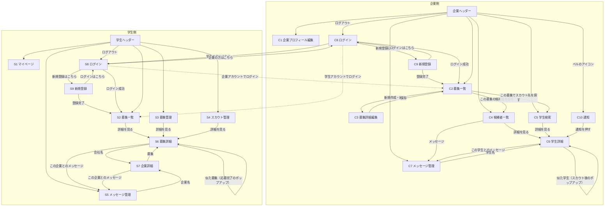

# ページ設計

> 章番号は designs/ 全体の通し番号（元の統合議事録の章番号のまま）。文中の「本書X章」「本書X-Y」は、次のファイルの該当する章を指す。
>
> - 0章（位置づけ・用語）、2章、4章、12章：[サービス概要_コンセプト.md](サービス概要_コンセプト.md)
> - 1章、事前調査、15章：[前提_調査まとめ.md](前提_調査まとめ.md)
> - 3章、9章：[技術構成.md](技術構成.md)
> - 5章、13章、0-1（AIへの依頼方針）：[その他決め事.md](その他決め事.md)
> - 6章：[ページ設計.md](ページ設計.md)
> - 7章：[処理設計_類似度.md](処理設計_類似度.md)
> - 8章：[データベース.md](データベース.md)
> - 10章、11章、14章：[未決内容.md](未決内容.md)
> - 16章：[API設計.md](API設計.md)
> - 17章：[権限_バリデーション.md](権限_バリデーション.md)
> - 18章：[開発環境.md](開発環境.md)

## 6. ページ構成

### 6-1. 画面一覧（19画面）と入口・操作

各画面の URL は本書16-1-13。

- このほかに、**振り分けだけを行う `/` がある**。ログイン中なら種別ごとのホーム（C2・S2）へ、未ログインなら学生のログイン画面（S8）へ移すだけで、中身のあるページではない。サービス紹介のページは作らないので、画面としては数えない（本書16-1-6）

企業側（10画面）

- C1 企業プロフィール編集｜入口：会社情報タブ｜操作：保存
- C2 募集一覧（企業のホーム）｜入口：募集管理タブ、C8（ログイン成功）、C9（登録完了）｜操作：新規作成・編集 → C3／この募集の候補者を見る → C4（募集で絞り込み）／この募集でスカウト先を探す → C5（募集条件で絞り込み）
- C3 募集詳細編集｜入口：C2｜操作：保存 → C2
- C4 候補者一覧｜入口：候補者管理タブ、C2｜操作：詳細を見る → C6／メッセージ（マッチ以降のみ）→ C7
- C5 学生検索｜入口：学生検索タブ、C2｜操作：詳細を見る → C6
- C6 学生詳細｜入口：C4、C5、C7、C10、C6（スカウト後のポップアップ）｜操作：募集タブ（自社の全募集）ごとに、状態に応じたボタン／この学生とのメッセージ（タブの外）→ C7／ポップアップの学生 → その学生の C6
- C7 メッセージ管理｜入口：メッセージタブ、C4、C6｜操作：送受信、学生名 → C6
- C8 ログイン（企業用）｜入口：未ログイン時、C9、S8、ログアウト｜操作：成功 → 元々開こうとしていたページ、なければ C2
- C9 新規登録（企業用）｜入口：C8｜操作：登録完了 → C2
- C10 通知｜入口：ヘッダーのベルのアイコン｜操作：通知を押す → C6／すべて既読にする

学生側（9画面）

- S1 マイページ（学生プロフィール編集）｜入口：マイページタブ｜操作：保存
- S2 募集一覧（学生のホーム）｜入口：募集検索タブ、S8（ログイン成功）、S9（登録完了）｜操作：詳細を見る → S6
- S3 募集管理｜入口：募集管理タブ｜操作：詳細を見る → S6
- S4 スカウト管理｜入口：スカウト管理タブ｜操作：詳細を見る → S6
- S5 メッセージ管理｜入口：メッセージタブ、S6、S7｜操作：送受信、企業名 → S7
- S6 募集詳細｜入口：S2、S3、S4、S7、S6（応募完了のポップアップ）｜操作：応募、マッチ、メッセージへ → S5、会社名 → S7、ポップアップの募集 → その募集の S6
- S7 企業詳細｜入口：S5、S6｜操作：募集 → S6／この企業とのメッセージ（スレッドがあるとき）→ S5
- S8 ログイン（学生用）｜入口：未ログイン時、S9、C8、ログアウト｜操作：成功 → 元々開こうとしていたページ、なければ S2
- S9 新規登録（学生用）｜入口：S8｜操作：登録完了 → S2

### 6-2. タブの役割（ヘッダー）

企業側

- 会社情報：学生に見せる自社情報を整える → C1
- 募集管理：募集の作成・編集と、募集を起点にした「候補者確認」「スカウト先探し」への入口 → C2
- 候補者管理：応募・スカウト・マッチ済みの相手を、横断（すべて）または募集別に整理する → C4
- 学生検索：まだ関係のない学生を探してスカウトする → C5
- メッセージ：スカウトした学生・マッチした学生との会話（企業×学生で1本）→ C7
- ベルのアイコン：「おすすめの学生」の通知。未読があれば件数を表示する → C10
- ログアウト

学生側

- マイページ：企業に見せる自分のプロフィールと稼働条件を作る → S1
- 募集検索：掲載中の募集を探す → S2
- 募集管理：応募した募集・マッチした募集を管理する → S3
- スカウト管理：届いたスカウトのうち、まだマッチしていないものを管理する → S4
- メッセージ：スカウトを受けた企業・マッチした企業との会話（企業×学生で1本）→ S5
- ログアウト

### 6-3. 画面遷移図

- Mermaid（マーメイド）形式で記述
- ヘッダーのタブは、どの画面からでも移動できるため、「ヘッダー」という1つの箱にまとめている

- 確認結果：行き止まりの画面や、どこからも入れない画面はない
- 作らないと決めた導線
  - S4 → S5 の直接導線：スカウト文は S6（募集詳細）を開き、そこの「この企業とのメッセージ」から読む
  - C7・S5 の上部に出す「マッチしている募集」から C6・S6 へ飛ぶ導線：名前を並べるだけにする

### 6-4. 段階タグ

タグの定義

- 【コア】課題要件の流れ（登録 → 募集 → スカウト・応募 → マッチ → メッセージ）に必要なもの。Phase 6 で最初に端から端まで通す
- 【強み】このプロダクトの主張（稼働条件の照合、一致・ずれの表示、推薦検索、見送りの扱い、応募理由、おすすめ）に関わるもの。コアが通った直後に入れる
- 【仕上げ】なくても流れは成立する利便性の部分。Phase 6 の後半から Phase 8
- 【後付け】Phase 7 以降（本書4-4、12章）。今回の19画面の中にはほぼ出てこない
- 各ページのタグは、6-5・6-6 の各ページの末尾に書いている。どのタグも付いていない項目は「タグ未付与」として書いている
- Phase 6 で作る順（【コア】順0〜8、【強み】順9〜15）は本書11-2

全画面に共通

- 【コア】権限制御（他社・他人のデータを見られない、未ログイン時はログイン画面へ）
- 【コア】ヘッダーのタブとログアウト
- 【コア】アイコンの表示（人・会社が並ぶすべての画面：C4、C5、C6、C7、S2、S5、S6、S7。入力は C1・S1・C9・S9）
  - あとから足すと画面の見た目を作り直すことになるため、最初から入れる
  - API はどの画面の分でも icon_url を返すので、追加の窓口は要らない（本書16-3 形B・形C）
- 【強み】推薦テーブルの更新処理（裏側のジョブ。本書7-5）
- 【仕上げ】一覧のページ分け、N+1問題の対策の点検（Phase 8 の重さの点検で確認）
  - S2 の募集一覧のページ分けだけは、順4 で前倒しして作った。返事の形（本書16-1-11）が決まっていて、合致・合致外の区切りがページをまたぐため、ページ分けと一緒でないと確かめられないため。ページ分けの部品は本書16-1-14

### 6-5. 各ページの詳細：企業側

- **C1 企業プロフィール編集**
  - 役割
    - 学生に見せる自社情報を整える。登録後の編集画面
    - ここで書いた内容は企業詳細（S7）に表示され、募集の「どんな会社か」「事業内容」の既定値にもなる
  - 表示（入力項目）
    - 会社名（必須）
    - 業界（任意、複数選択。本書5-8 の15個）
    - 事業形態（任意、複数選択。本書5-8 の4つ）
      - 業界・事業形態は、会社の紹介として企業詳細（S7）に表示するだけ。検索・おすすめには使わない（使うのは募集ごとの値。本書5-8）
    - 事業内容（任意、文章）
    - 人数（任意、選択：1〜9／10〜49／50〜99／100〜299／300〜999／1000以上。範囲は仮置き）
    - どんな会社か（任意、文章）
    - アイコン（任意。PNG（ピング）・JPEG（ジェイペグ）・WebP（ウェブピー）、2MB 程度まで）
  - 操作
    - 保存
  - 画面以外の決まりごと
    - 保存すると、その企業の、一度でも掲載した募集それぞれについて、似た募集リストを作り直す（裏側のジョブ。本書7-5）
  - 段階タグ
    - 【コア】全項目と保存

- **C2 募集一覧**
  - 役割
    - 募集の作成・管理と、募集を起点にした候補者確認・スカウトへの入口
    - 企業のホーム。ログイン後と、新規登録の完了後の行き先
  - 表示
    - 上部に「募集新規作成」ボタン
    - 登録完了後の行き先になるため、「最初の募集を作成する」への導線を目立たせる（企業のおすすめに効く情報のほとんどが、募集ごとの項目のため）
    - 自社の全募集のリスト。各行に「編集する」「この募集の候補者を見る」「この募集でスカウト先を探す」の3つのボタン
    - 各行に、タイトル、状態、最初に掲載した日、最終更新日、未対応の応募の件数を出す。並び順は最終更新の新しい順（本書16-3 ⑪）
  - 操作
    - 募集新規作成 → C3（空の状態）
    - 編集する → C3（その募集）
    - この募集の候補者を見る → C4（その募集のタブを選択した状態）
    - この募集でスカウト先を探す → C5（その募集を選択し、条件が自動入力された状態）
  - 段階タグ
    - 【コア】自社の募集リスト（行のタイトル・状態・最初に掲載した日・最終更新日を含む）、新規作成、編集、「この募集の候補者を見る」
    - 【強み】「この募集でスカウト先を探す」（C5 の推薦検索につながる）
    - 【仕上げ】行に出す未対応の応募の件数
    - タグ未付与：「最初の募集を作成する」への導線

- **C3 募集詳細編集**
  - 役割
    - 募集の新規作成と編集（同じ画面を使う）
    - 募集の状態の切り替えもここで行う
  - 表示（入力項目・学生に見せるもの）
    - 募集状態（必須）：非公開／掲載中／終了。3つは自由に行き来できる（本書17-2-2）
    - 会社名（企業プロフィールから自動で表示）
    - 募集タイトル（必須）
    - 職種：主な中分類・関連する中分類（それぞれ複数、上限なし）。大分類 → 中分類の2段階。境界が曖昧な組み合わせの判定ルールを添える
    - 工程：「メインで担当する工程」と「関われる工程」。該当する大分類の工程を上に並べる
    - 業界・事業形態（任意、それぞれ複数選択。本書5-8）：この募集の事業の分野と形。企業プロフィールの値とは別に持ち、空欄でも企業の値で補わない。検索・おすすめ・比較にはこの値を使う
    - 募集概要
      - どんな会社か（空欄なら企業プロフィールの内容を表示）
      - 事業内容（空欄なら企業プロフィールの内容を表示）
      - インターンですること（掲載に必要）
      - 成長イメージ
    - 稼働条件：共通形式の企業側（週の稼働日数、1日の稼働時間、継続期間、開始時期、勤務形態＋補足、勤務地＋最寄り駅など、土日OK、備考）。すべて任意
      - 開始時期は「年」と「月」の2つの選択欄。両方空欄なら随時。年の選択肢は1年前〜2年後（今年は日本時間で数える）で、保存済みの年がその範囲の外なら、その年も選択肢に足す（Rails 側は範囲を制限しない。本書5-6、17-3-4）
      - 片方だけ選んで保存を押したら、「開始時期は年と月の両方を選んでください」と出して止める（画面側だけの確認。本書17-3-6）
    - 給与：時給（掲載に必要、円）
    - カルチャーグラフ（必須）：学生の性格と同じ5軸のスライダー。初期値は中央
    - 必須要件・歓迎要件（どちらも任意）：文章
    - 使用言語・フレームワーク・技術：共通マスタから選択＋文章
  - 表示（入力項目・学生には見せないもの）
    - 目的：採用／戦力／両方
    - 採用につながる可能性：高い／あり／なし（選択肢は仮置き）
    - 求める人材
      - 学年（選択、複数可。学生プロフィールの学年と同じ選択肢）
      - 卒業年度（○年〜○年。片方だけの指定も可）
      - その他特徴（文章）
  - 操作
    - 保存 → C2
  - 画面以外の決まりごと
    - 必須は2段。募集状態・タイトル（・カルチャーグラフ）は常に必須。インターンですること・時給は「掲載に必要」で、状態が掲載中のときだけ確認する（本書5-9、17-3-3）
      - 非公開なら書きかけでも保存できる（下書きとして使う）
      - 画面では「掲載に必要」の項目に印を付け、保存を押したときに同じ条件でその場で確認する
    - 初めて掲載中にしたときに、最初に掲載した日時を記録する（新着順と、一度でも掲載したかの判定に使う）。再掲載しても更新しない
    - 一度でも掲載した募集を保存すると（初めて掲載したときを含む）、その募集の似た募集リストを作り直す（裏側のジョブ。本書7-5）
  - 段階タグ
    - 【コア】募集状態、タイトル、募集概要（空欄なら企業プロフィールの値を表示）、稼働条件の入力、時給、必須要件・歓迎要件、使用技術、職種（大分類 → 中分類）、必須チェック
    - 【強み】工程（メイン／関われる）、業界・事業形態、カルチャーグラフ
    - 【仕上げ】目的・求める人材（学生に見せず、ロジックでも使わない項目）、境界が曖昧な職種の判定ルールの表示

- **C4 候補者一覧**
  - 役割
    - 応募・スカウト・マッチ済みの相手を整理し、次の対応を決める
  - 表示
    - タブ：「すべて」（既定）＋募集別。C2 から来た場合はその募集のタブを選択
    - 行の単位：やりとり1件（募集×学生）＝1行
    - 未マッチの行のタグ：未対応応募／スカウト済み
    - マッチ以降の行のタグ：未返信（学生が最後に送り、企業がまだ返していない）／なし
    - 見送り・合格・不合格は既定で非表示。「合格者・不合格者（見送りも含む）も併せて表示」で表示される
    - 各行に、学生の名前・学年・卒業年度・活動状況、募集名、状態とタグ、やりとりが始まった日を出す。並び順は、やりとりが始まった日の新しい順（本書16-3 ㉑）
  - 操作
    - 詳細を見る → C6（その募集のタブを選択した状態）
    - メッセージ（マッチ以降の行のみ）→ C7（その学生のスレッド）
  - 段階タグ
    - 【コア】やりとり1件＝1行のリスト、「すべて」と募集別のタブ、未対応応募／スカウト済みのタグ、詳細を見る、メッセージ
    - 【強み】見送り・合格・不合格を既定で隠し、切り替えで表示
    - 【仕上げ】未返信タグ、行に出す学生情報、並び順
  - 作る順
    - 「メッセージ」のボタンは、行き先の C7 を作る順7 で足す。先に置くと、押しても「見つかりません」になるため（本書11-2）

- **C5 学生検索**
  - 役割
    - まだ関係のない学生を探してスカウトする
  - 表示
    - 検索条件
      - 募集を選ぶと、その募集の稼働条件（入力済みの項目）で、条件のボタンが自動で選ばれる（推薦検索）。手動で調整可。募集を選ばず条件だけでも検索可
      - 検索条件の項目：フリーワード（自己PR、資格名、プログラミング歴の「その他」。名前と大学名は対象にしない）、稼働条件（週の日数、1日の時間、継続期間、開始時期、勤務形態、勤務地）、使用技術とレベル、職種、学年、卒業年度、活動状況（本書16-3 ㉒）
    - 並び順
      - 「○○募集におすすめ順」：企業が自社の募集を1つ選ぶと、f(募集, 学生) の高い順に並ぶ（本書7章）
      - おすすめ順以外の並び順は、最終活動が新しい順。募集を選んでいないときは、こちらが既定
    - 結果：学生のリスト
      - **条件で結果を減らさない。** 条件を全部満たす学生を上、1つでも外れる学生を下に並べ、境目に「ここから条件に合いません」の区切りを出す（本書7-3）
      - 件数は「条件に合う◯人／全◯人」の2つを出す
      - 条件に合う人が0人のときは、区切りが先頭に来る
      - 募集を選んだときは、その募集とのやりとりの状態をタグで出す（未対応応募、スカウト済み、マッチ、見送り、合格、不合格）。選んでいないときは、自社のどれかの募集とやりとりがあれば「やりとりあり」
      - 各学生の最終活動の目安（3日以内／7日以内／30日以内）
  - 操作
    - 詳細を見る → C6
  - 画面以外の決まりごと
    - 最終活動日から30日以上たった学生は、検索対象から**除外**する（おすすめ順以外の並び順でも同じ）。これは利用者が指定した条件ではないため、2群に分けるのではなく外す（本書7-3）
    - 活動状況が「今は探していない」の学生は、結果から外さない
    - 条件を指定した項目が未入力の学生は、合致外の群に入れる（結果には出る。本書5-10）
    - 並び順に関係なく、いつも2群に分ける（本書7-3）
  - 段階タグ
    - 【コア】学生のリスト、基本的な条件検索、詳細を見る
    - 【強み】募集を選ぶと条件が自動で入る推薦検索、「○○募集におすすめ順」
    - 【仕上げ】やりとりのタグ、最終活動の目安の表示
    - タグ未付与：30日以上活動のない学生の除外

- **C6 学生詳細**
  - 役割
    - 1人の学生を見て、募集ごとに判断・操作する
  - 表示
    - 募集タブ：自社の全募集（掲載中以外も含む）。遷移元の募集を初期選択、なければ先頭
    - 各タブの中身：学生のプロフィール（マッチ前でもすべて見せる）と募集内容の比較、その募集での状態、状態に応じたボタン
    - 比較の見せ方
      - 離散的に一致を判定できる項目（稼働条件、職種、技術、業界（募集の業界と学生の興味のある業界）、学生の興味との一致など）は、一致したものの枠をオレンジにする。色だけに頼らず「一致」の文字も併記する
      - カルチャー5軸は、数直線上に学生と募集の2点を置き、間の距離をオレンジで示す。距離が1以下の軸は背景を薄いオレンジにする
      - どちらかが中央（こだわらない）の軸は、背景の強調をしない（表示のルール。点数の計算とは別）
      - どちらかが未入力の項目は判定せず、「未入力」と表示する
      - 学生が応募理由・マッチ理由として選んだ項目には、比較の中で小さく♥などの印を付ける
      - 合計点（おすすめ度）は表示しない
    - 学生の最終活動の目安
  - 操作（その募集での状態ごと）
    - 関係なし
      - 掲載中：「スカウトをする」→ 文面入力 → 送信 → スカウト済みになる。文面は C7 のスレッドの最初のメッセージになる。送信後に「この学生に似た学生」のポップアップを出す
      - 掲載中以外：ボタンなし
    - 未マッチ（応募）
      - 掲載中：「マッチする」→ マッチ／「見送る」→ 見送り
      - 掲載中以外：「見送る」のみ
    - 未マッチ（スカウト）
      - 「スカウト済み」と表示＋「見送る」
    - マッチ
      - 「合格／不合格として保存」
    - 見送り（応募由来）
      - 「見送りを取り消す」→ 未対応応募に戻る（募集の状態に関係なく同じ）
      - 掲載中なら、加えて「マッチする」→ マッチ
    - 見送り（スカウト由来）
      - 「見送りを取り消す」→ スカウト済みに戻る（募集の状態に関係なく同じ）
      - 見送り中に学生が応じた場合は、マッチとして再表示される
      - ※「スカウトは学生が応じたときにマッチ」という方針と整合させるため、企業側に「マッチする」は出さない
    - 合格・不合格
      - 合格／不合格の付け替え（募集の状態に関係なく同じ）
  - 操作（募集タブの外。学生ごと）
    - 「この学生とのメッセージ」→ C7
      - **その学生とのスレッドがあるときに出す**（本書17-2-3）。スレッドができるのは、スカウトを送ったときか、応募がマッチしたとき
      - どの募集タブを見ていても同じように出る。メッセージは「募集ごと」ではなく「相手ごと」のため
      - 送れるかどうか（マッチ以降が1つでもあるか）は C7 の入力欄が決める。まだ返信のないスカウトでも、自分が送った文面を読みに行ける
  - スカウト送信後のポップアップ
    - 「この学生に似た学生」を5人表示する（f(学生, 学生) の上位5人）
    - 30日以上活動のない学生と、その募集とやりとりがある学生は除外する
    - スカウトに使った募集の稼働条件に**合う学生を優先**し、5人に満たなければ合わない学生からも補充する（本書7-3）。それでも足りなければ、ある分だけ表示する
    - 各学生を押すと、その学生の C6 へ移動する
  - 画面以外の決まりごと
    - スカウト送信は、やりとり・スレッド（まだなければ）・メッセージ・スカウトメッセージを1つのトランザクションで作る（本書9-2）
    - 応募にマッチするときは、やりとりの更新と、スレッドの作成（まだなければ）を1つのトランザクションで行う
    - 見送ると、裏側のジョブで、似た募集を持つ他社に「おすすめの学生」の通知を作る（本書7-5）。見送った会社自身の募集は通知先から除外する
    - スカウト文面の入力場所（画面内か別画面か）は未決
    - 募集タブの中のボタンは、API が返す「今押せる操作」（available_actions）に従う。タブの外のメッセージのボタンは has_message_thread に従う（本書16-3 ㉓）
  - 段階タグ
    - 【コア】学生プロフィールの表示、募集タブ、「スカウトをする」（文面入力 → 送信）、「マッチする」、「この学生とのメッセージ」、掲載中以外の募集でボタンを出さない制御
    - 【強み】比較の表示（稼働条件などの一致・不一致、カルチャー5軸の数直線）、応募理由・マッチ理由の♥印、見送る・見送りを取り消す、合格・不合格の保存と付け替え、スカウト送信後のポップアップ
    - 【仕上げ】最終活動の目安の表示

- **C7 メッセージ管理**
  - 役割
    - スカウトした学生・マッチした学生との会話。面談日程調整の案内（外部フォームの URL など）を送るまでが主な用途
  - 表示
    - スレッド一覧：企業×学生で1本。スカウトした学生とマッチした学生。最後のメッセージの日時で並べる
    - チャット：選んだスレッドのメッセージ。スカウト文が最初のメッセージ。どの募集のスカウトかも表示できる。上部にその学生とマッチしている募集を表示
    - 学生のアイコン（アイコンを必ず表示する画面）や名前：押すと C6 へ
  - 操作
    - 送信 → 学生に届く（その学生と1つもマッチしていない間は送れない）
    - C4・C6 から来た場合は、その学生のスレッドを開いた状態で表示
  - 画面以外の決まりごと
    - リアルタイム更新はしない。画面を開いたとき・再読み込みしたときに最新を取る
    - 上部の「マッチしている募集」は名前を並べるだけにし、そこから C6 へ飛ぶ導線は作らない
  - 段階タグ
    - 【コア】スレッド一覧、チャット、送信、スカウト文を最初のメッセージとして表示、マッチしていない間は送れない制御、C4・C6 から来たときにそのスレッドを開く
    - 【仕上げ】上部にマッチしている募集を表示、学生名から C6 へ

- **C8 ログイン（企業用）**
  - 役割
    - 企業アカウントでサービスに入る
  - 表示
    - 入力欄：メールアドレス、パスワード
    - 「ログイン」ボタン
    - 「新規登録はこちら」リンク → C9
    - 「学生の方はこちら」リンク → S8
  - 操作
    - ログイン成功 → 元々開こうとしていたページ、なければ C2
    - ログイン失敗 → 同じ画面に「ログインができません」とだけ表示する。どちらが違うか、メールアドレスが登録済みかどうかは出さない（本書17-3-1）
  - 画面以外の決まりごと
    - 認証処理は企業・学生で共通。ログイン後に種別で行き先を振り分ける（学生アカウントでこの画面からログインした場合は、学生のホーム（S2）へ）
    - ログイン済みの状態でこの画面を開いた場合は、種別ごとのホーム（企業は C2、学生は S2）へ移動する（本書16-1-6）
    - ログインしていない状態で企業用の各ページを開いた場合は、この画面へ移動する。開こうとしていたページを覚えておき、ログイン後にそこへ戻す（本書16-1-6）
    - 認証方式は Cookie＋セッション、CSRF 対策あり（本書3-1）
    - ログアウトは画面ではなく、ログイン後のヘッダーに置く
  - 段階タグ
    - 【コア】入力欄、ログインボタン、失敗時の共通エラー文言、成功時に C2 へ、学生アカウントなら学生のホームへ、「新規登録はこちら」「学生の方はこちら」のリンク
    - 【仕上げ】元々開こうとしていたページへ戻る、ログイン済みで開いたら種別ごとのホームへ移動、ログインの回数制限

- **C9 新規登録（企業用）**
  - 役割
    - 企業アカウントを作る。ステップ形式で会社情報まで聞き、全ステップの入力が終わった時点でアカウントを作る
  - 表示
    - ステップ1 アカウント：メールアドレス、パスワード、パスワード（確認）、会社名、利用規約・プライバシーポリシーへの同意チェック（おすすめへの影響：―）
    - ステップ2 会社情報：業界、事業形態、人数、事業内容、どんな会社か、アイコン（おすすめへの影響：―。業界・事業形態は会社の紹介として表示するだけ。本書5-8）
    - 各ステップの上部に進み具合（例：1／2）を表示する
    - おすすめに効く項目には「入力するとおすすめの精度が上がります」と一言添える
    - 最後のステップに「登録する」ボタン
    - 「すでにアカウントをお持ちの方はこちら」リンク → C8
  - 操作
    - ステップ1から進むとき：メールアドレスの重複を確認する（全部入力した後にやり直しにならないように）
    - 登録成功 → 自動でログインし、C2 へ（最初の募集の作成へ誘導する）
    - 登録失敗 → 同じ画面に項目ごとのエラー表示（メールアドレスが登録済み、パスワードが短い、確認用と一致しない、など。本書17-3-1）
  - 画面以外の決まりごと
    - 全ステップの入力を画面側で保持し、最後の「登録する」で、ログイン情報（種別＝企業）、企業プロフィール、付属情報（業界・事業形態）を1つのトランザクションでまとめて作る
    - アイコンは、登録が成功した直後に別の窓口で送る。失敗しても登録は取り消さず、「アイコンを保存できませんでした。あとで会社情報から登録してください」と出してホームへ進む（本書16-3 ⑤）
    - 途中でやめた人のデータはデータベースに残らない。途中で再読み込みやブラウザを閉じると、入力は消える
    - データベースの必須項目は変えない（本書5-9）。必須はステップ1だけ（学生はステップ2の活動状況も）。それ以外のステップは「あとで入力する」で飛ばせる（本書17-3-5）
    - 「次へ」「あとで入力する」「登録する」のボタンは押せなくせず、押したときに足りない項目を示して進まない（本書17-3-2・17-3-5）
    - 企業のおすすめに効く情報（職種、工程、業界、技術、カルチャー）は、すべて募集ごとの項目なので、登録後に募集の作成へ誘導する
    - パスワードは Rails 標準の仕組み（has_secure_password）で暗号化して保存する
  - 段階タグ
    - 【コア】ステップ形式の登録、入力欄、登録ボタン、項目ごとのエラー、登録後に自動でログインして C2 へ
    - 【仕上げ】利用規約・プライバシーポリシーの同意チェック（文面はダミー）、登録ステップの進み具合の表示
    - タグ未付与：おすすめに効く項目への一言

- **C10 通知**
  - 役割
    - 自社に届いた「おすすめの学生」を一覧で確認し、学生詳細へ移動するための画面
  - 入口
    - ヘッダーのベルのアイコン。未読があれば件数を表示する（10件以上は「9+」など）
  - 表示
    - 自社宛ての通知を新しい順に並べる
    - 各行には、本文と日時（「3時間前」「9月20日」など）を表示する
    - 未読の行は、背景色と未読マークで区別する
    - 通知が1件もないときは「通知はありません」と表示する
    - 件数が多いときはページ分けする
  - 操作
    - 行を押すと、その通知を既読にして、リンク先（C6 学生詳細）へ移動する
    - 「すべて既読にする」ボタン
  - 通知が作られるとき
    - 学生Sが募集Pで見送られたとき、Pに似た募集（f(募集P, 募集Pi) の上位）を持つ企業に「おすすめの学生S」を通知する
    - 同じ会社の似た募集が複数あれば、1社1件にまとめ、上位5社に送る
    - 除外するもの：30日以上活動のない学生、見送った会社自身の募集、学生Sとやりとりがある募集、掲載中以外の募集
    - 通知先の募集の稼働条件に**合う場合を優先**し、5社に満たなければ合わない場合からも補充する（本書7-3。ポップアップと同じ扱い）
    - 本文の例：「（自社の募集名）に合いそうな学生がいます」
  - 画面以外の決まりごと
    - 見られるのは自社宛ての通知だけ。既読にできるのも自社の通知だけ
    - 通知は、見送りをきっかけにした推薦の処理（裏側のジョブ）で作る
    - 本文に、募集Pのことや、見送りがあったこと、他社での行動を書かない
    - 本文は作成時点の文言で固定する
    - 見送りを取り消しても、送った通知は取り消さない
    - リンク先を見られるかは、移動先の画面でいつもどおり権限を確認する
    - 画面側では、リンク先が `/` から始まるときだけリンクにする（外部サイトへのリンクを通知に仕込めないようにするため）
    - 未読件数はページを開いたときに取得する（リアルタイム更新はしない）
  - 段階タグ
    - 【強み】C10 通知（画面と、通知を作る処理の全体）

### 6-6. 各ページの詳細：学生側

- **S1 マイページ（学生プロフィール編集）**
  - 役割
    - 企業に見せる自分のプロフィールと稼働条件を作る。登録後の編集画面
  - 表示（入力項目）
    - 名前（必須、文章）
    - 大学名（選択）：大学マスタから選ぶ。文部科学省の学校コード一覧を元にできる。デモ用に一部だけでもよい
      - 選択肢の最後に「その他（一覧にない大学）」を置き、選ぶとその下に大学名の入力欄を出す（海外の大学など。本書8-5）
      - 「その他」を選んで大学名が空欄のまま保存を押したら、「大学名を入力してください」と出して止める（画面側だけの確認。本書17-3-6）
    - 学部・学科（選択）：大学とは切り離した共通の一覧にし、「学部 → その学部の学科」の2段階で選ぶ。中身は仮データでよい（工学部、文学部など）。各学部に「その他」を入れる
    - 学年（選択）：学部1年／学部2年／学部3年／学部4年／学部5年以上／修士1年／修士2年／博士／高専／その他
    - 在住の都道府県（選択）
    - 自己PR（文章。3つの問い）
      - 自分の強み、向いていること
      - 向いていないこと
      - この先やりたいこと、挑戦したいこと
    - プログラミング歴（複数登録できる）：言語・フレームワーク（共通マスタから選択、なければ「その他」に入力）、年数（0.5年なども入力できる）、レベル（v1〜v4 から選択）
      - 行ごとのエラーは、その行の下に出す（本書16-3 ⑯）
    - 外部リンク（複数可）：GitHub、ポートフォリオ、成果物など。URL と表示名
    - 資格（資格名を入力、複数可）
    - 就活状況：卒業年度（選択。選択肢は今年〜10年後で、保存済みの年がその範囲の外なら、その年も足す。Rails 側は範囲を制限しない。本書17-3-4）、興味のある業界（複数選択）、興味のある職種（中分類から複数選択）、就活希望エリア（都道府県、複数選択）
    - 性格（企業のカルチャーグラフと同じ5軸のスライダー。初期値は中央）
    - 稼働条件：共通形式の学生側（週の稼働日数、1日の稼働時間、継続期間、開始時期、勤務形態（初期状態は3つとも可能）、出社できる都道府県（初期値なし。在住の都道府県から自動で選ばない）、備考）
      - 開始時期は、募集（C3）と同じく「年」と「月」の2つの選択欄。年の選択肢も同じ（1年前〜2年後に、保存済みの年を足す）。範囲の制限はなし。片方だけ選んで保存を押したら、「開始時期は年と月の両方を選んでください」と出して止める（本書5-6、17-3-6）
    - 活動状況（必須）：参加目的（今は探していない／スキルアップ目的／就活目的）
    - アイコン（任意。PNG・JPEG・WebP、2MB 程度まで）
  - 操作
    - 保存
  - 画面以外の決まりごと
    - 必須は名前と活動状況だけ（保存時にアプリで確認）
    - 入力した情報は、マッチ前でも企業にすべて見せる
    - 活動状況で「今は探していない」を選んでも、企業の学生検索からは外れない
    - 大学名、学部・学科、在住の都道府県は、おすすめの近さの計算に使わない
    - 保存すると、その学生の似た学生リストを作り直す（裏側のジョブ。本書7-5）
    - 本番運用で学部・学科を実データにするときは、大学ごとの一覧か、「情報系／機械系」のような系統で選ぶ形に変える
  - 段階タグ
    - 【コア】名前、大学名、学部・学科、学年、在住の都道府県、自己PR、プログラミング歴（複数登録）、卒業年度、興味のある職種、稼働条件、活動状況、アイコン、保存
    - 【強み】性格5軸
    - 【仕上げ】外部リンク（複数）、資格、興味のある業界、就活希望エリア

- **S2 募集一覧**
  - 役割
    - 掲載中の募集を一覧・検索する
    - 学生のホーム。ログイン後と、新規登録の完了後の行き先
  - 表示
    - 上部に検索フィルター、下部に検索結果。掲載中の募集のみ
    - 各行：会社名、タイトル、業界・事業形態・職種・工程（すべて募集の値）、勤務地・勤務形態、時給、稼働条件（最低継続期間、週○日〜、1日○時間〜）
    - 並び順
      - 既定はおすすめ順（f(募集, 学生) の高い順。本書7章）。点数が同じ募集どうしは、新着順で並べる
      - 新着順（最初に掲載した日時が新しい順）に切り替えられる
      - プロフィールがほとんど空の学生でも分岐せず、そのままおすすめ順で出す（ほぼランダムに近い並びでもよい）
    - 検索結果の出し方
      - **条件で結果を減らさない。** 条件を全部満たす募集を上、1つでも外れる募集を下に並べ、境目に「ここから条件に合いません」の区切りを出す（本書7-3）
      - 件数は「条件に合う◯件／全◯件」の2つを出す。条件に合う募集が0件のときは、区切りが先頭に来る
      - 並び順（おすすめ順・新着順）に関係なく、いつも2群に分ける
  - 操作
    - 検索条件
      - ① フリーワード。募集詳細（S6）の画面に出る文章すべて（タイトル、募集概要の4つ、必須要件、歓迎要件、使用技術の補足、勤務形態の補足、最寄り駅など、稼働の備考）と、会社名・使用技術の名前・職種（中分類と大分類）の名前が対象。都道府県と勤務形態の名前は対象外（②③で探す）。詳しくは本書16-3 ⑱
      - ② 勤務地（フルリモートの募集は、勤務地に関係なく出る）
      - ③ 稼働条件などの特徴：週の日数、1日の時間、継続期間、開始時期、勤務形態の選択ボタンと、土日OK。ボタンの選択肢は稼働条件の共通形式（本書5-6）と同じ。学生側の言い方（「週◯日まで」「◯時間まで」「◯ヶ月以上」「◯年◯月から働ける」）で出す
        - おすすめ順のときは、自分のプロフィールの稼働条件（入力済みの項目）に合わせて、③のボタンと②の勤務地（出社できる都道府県）が自動で選ばれる。手動で選び直せる
        - 新着順に切り替えると、稼働条件のボタンはすべてオフになる。おすすめ順に戻すと、もう一度自動で選ばれる
        - 開始時期で年と月の片方だけを選んで「検索する」を押したら、「開始時期は年と月の両方を選んでください」と出して止める（画面側だけの確認。本書17-3-6）
      - ④ 業界・事業形態・職種（大分類 → 中分類）・使用技術・工程（「企画・設計から関われる」）
        - 使用技術はマスタから選ぶ（どれか1つを使う募集が合う）。フリーワードでは拾えない表記の揺れ（「JS」と「JavaScript」など）を補うため。フリーワードでも技術の名前は探せる
    - 条件欄の見た目と動き
      - `[勤務地] [職種] [技術] [稼働条件] (フリーワード) [検索する]` を横に並べる（狭い画面では折り返す）。業界・事業形態・「企画・設計から関われる」は、作るときにボタンを足す
      - 各ボタンを押すとポップアップが開き、中で選ぶ。勤務地は47都道府県をそのまま並べ、職種・技術は開閉する行（大分類・技術の区分ごと）を出す
      - ボタンには選んでいる数を出す（例：「勤務地（2）」）。ポップアップの下に「この条件をクリア」「閉じる」
      - ポップアップの中で選んだものは、その場で画面の中の下書きに入る（「決定」の押し忘れで消えない）。**検索は「検索する」を押したときだけ**（ポップアップを閉じても検索しない。条件を3つ選ぶ間に3回検索が走らないように）
      - 並び順は、選んだ時点ですぐ反映する（今の条件のまま、並び順だけを変える）
      - 条件・並び順・ページは画面の URL の `?` の後ろに持つ（本書16-1-13）。ブラウザの「戻る」で、条件欄も結果も前の検索に戻る
    - ページ送り（「前へ 1 … 4 5 6 … 10 次へ」）。今の条件を残したまま、ページだけを変える
    - 詳細を見る → S6
  - 画面以外の決まりごと
    - 職種は、募集の主な中分類・関連する中分類のどれか1つが一致すればヒットする。「フロントエンド」「バックエンド」で検索したときは、フルスタックの募集も表示する
    - 業界・事業形態は、募集の値のどれか1つが一致すればヒットする。企業プロフィールの値は使わない（本書5-8）
    - 条件を指定した項目が未入力の募集は、合致外の群に入れる（結果には出る。本書5-10）
    - 掲載中でない募集だけは除外する。これは利用者が指定した条件ではないため（本書7-3）
  - 段階タグ
    - 【コア】掲載中の募集のリスト、行の表示（稼働条件の1行表示を含む）、フリーワード、勤務地、職種（大分類 → 中分類）、使用技術、新着順、詳細を見る
    - 【強み】おすすめ順（既定の並び順。本物の点数）、おすすめ順のときの稼働条件のボタンの自動選択、「企画・設計から関われる」
    - 【仕上げ】業界・事業形態のフィルター、フロントエンド・バックエンドで検索したときにフルスタックも含めるルール
    - 順4 で前倒しして作ったもの：稼働条件のボタンの手動の選択と土日OK（【仕上げ】から）、ページ分け（全画面に共通の【仕上げ】から。6-4）、おすすめ順の並び替えの通り道（点数は仮に全件0点。本書16-3 ⑱）

- **S3 募集管理**
  - 役割
    - 自分が応募した募集・マッチした募集を一覧で管理する。スカウトからマッチした募集もここに入る
  - 表示
    - S2 と同じ行の表示＋タグ（応募済み／マッチ済み）。タグで絞り込み可
    - 企業側で見送り・合格・不合格になっていても、学生には応募済み・マッチ済みのまま見える
    - 掲載中以外の募集は「募集終了」と表示
  - 操作
    - 詳細を見る → S6
  - 画面以外の決まりごと
    - ここに出るもの：発生元が応募のもの（状態は問わない）と、発生元がスカウトで状態がマッチ・合格・不合格のもの
  - 段階タグ
    - 【コア】応募済み・マッチ済みのリスト、「募集終了」表示、詳細を見る
    - 【仕上げ】タグでの絞り込み

- **S4 スカウト管理**
  - 役割
    - 届いたスカウトのうち、まだマッチしていないものを管理する
    - スカウトが大量に来たときに応募・マッチ済みと混ざらないよう、募集管理と分けてヘッダーに置く
  - 表示
    - S2 と同じ行の表示＋「スカウトあり」のタグ
    - マッチすると S3 に移る
    - 掲載中以外の募集は「募集終了」と表示
  - 操作
    - 詳細を見る → S6
  - 画面以外の決まりごと
    - ここに出るもの：発生元がスカウトで、状態が未マッチ・見送りのもの（見送りは学生に見せないため）
    - 各行から S5 のスレッドへ直接飛ぶ導線は作らない。スカウト文は、詳細を見る（S6）を開き、そこの「この企業とのメッセージ」から読む
  - 段階タグ
    - 【コア】スカウトありのリスト、「募集終了」表示、詳細を見る

- **S5 メッセージ管理**
  - 役割
    - 企業との会話。スカウト文の確認と、マッチ後の面談日程などの連絡
  - 表示
    - スレッド一覧：企業×学生で1本。スカウトを受けた企業とマッチした企業。最後のメッセージの日時で並べる
    - チャット：選んだスレッドのメッセージ。スカウト文が最初のメッセージ。どの募集のスカウトかも表示できる。上部にその企業とマッチしている募集を表示
    - 企業のアイコン（アイコンを必ず表示する画面）や企業名：押すと S7 へ
  - 操作
    - 送信 → 企業に届く（その企業と1つもマッチしていない間は返信できない）
    - S6・S7 から来た場合は、その企業のスレッドを開いた状態で表示
  - 画面以外の決まりごと
    - リアルタイム更新はしない。画面を開いたとき・再読み込みしたときに最新を取る
    - 上部の「マッチしている募集」は名前を並べるだけにし、そこから S6 へ飛ぶ導線は作らない
  - 段階タグ
    - 【コア】スレッド一覧、チャット、送信、スカウト文を最初のメッセージとして表示、マッチしていない間は送れない制御、S6・S7 から来たときにそのスレッドを開く
    - 【仕上げ】上部にマッチしている募集を表示、企業名から S7 へ

- **S6 募集詳細**
  - 役割
    - 募集の中身を見て、応募する・スカウトに応じる
  - 表示
    - タイトル
    - 会社名（押すと S7）
    - 勤務地・勤務形態（補足を含む）
    - 時給
    - 業界・事業形態・職種・工程（すべて募集の値）
    - 募集概要：どんな会社か、事業内容（募集側が空欄なら企業プロフィールの内容）、インターンですること、成長イメージ
    - カルチャーグラフ（自分の性格との一致・ずれも表示。本書5-5）
    - 稼働条件：週の稼働日数、1日の稼働時間、継続期間、開始時期、土日OK、備考
    - 必須要件・歓迎要件
    - 使用言語・フレームワーク・技術
    - 空欄の項目は「未入力」と出す（開始時期の空欄だけは「随時」）。企業が入れた改行はそのまま出す
    - 項目は、元になるデータができる順で足していく（順4 で表示、順5 で応募と状態、順6 でマッチと「この企業とのメッセージ」、順9・10 で業界・事業形態・工程とカルチャーグラフ。本書16-3 ⑲）
  - 操作（その募集での状態ごと）
    - 関係なし：「応募する」→ 応募理由を選ぶ（12項目から複数、最低1つ。本書5-1）→ 応募済みになる → 応募完了のポップアップ
    - 応募済み：「応募済み」と表示（企業側で見送りになっていても同じ）
    - スカウトあり：「マッチする」→ マッチ理由を選ぶ（応募と同じ12項目から複数、最低1つ）→ マッチ済みになり、S3 に表示される
    - マッチ済み：「マッチ済み」と表示（企業側で合格・不合格になっていても同じ）
    - 募集終了（掲載中以外）：「募集終了」と表示し、応募・マッチは押せない
  - 操作（状態に関係なく、企業ごと）
    - 「この企業とのメッセージ」→ S5
      - **その企業とのスレッドがあるときに出す**（本書17-2-3）。スカウトが届いた時点でスレッドはあるので、**マッチする前でもスカウト文を読める**
      - 応募しただけ（まだマッチしていない）のときは、会話がないので出ない
      - 送れるかどうかは S5 の入力欄が決める
  - 応募完了のポップアップ
    - 「応募が完了しました」の下に、「この募集に似た募集」を5件表示する（f(募集, 募集) の上位5件）
    - やりとりがある募集と、掲載中以外の募集は除外する
    - 自分の入力済みの稼働条件に**合う募集を優先**し、5件に満たなければ合わない募集からも補充する（本書7-3）。それでも足りなければ、ある分だけ表示する
    - 各募集を押すと、その募集の S6 へ移動する
    - 通知はしない
  - 画面以外の決まりごと
    - 応募・マッチでは、やりとり（応募のとき）、応募理由、応募理由の組の写し（reason_mask）を同じトランザクションで保存する。推薦テーブルの更新は、その後に裏側のジョブで行う（本書7-5）
    - 非公開・終了の募集は、その募集とやりとりがある学生だけが開ける（「募集終了」と表示）。関係のない学生と、一度も掲載していない募集は開けない（本書16-1-10）
  - 段階タグ
    - 【コア】全表示項目、会社名から S7 へ、「応募する」、「マッチする」、応募理由・マッチ理由の選択（最低1つ必須）、状態の表示（応募済み／マッチ済み／募集終了）、「この企業とのメッセージ」
    - 【強み】カルチャーグラフと自分の性格との一致・ずれ、応募完了のポップアップ

- **S7 企業詳細**
  - 役割
    - 企業のプロフィールを見る
  - 表示
    - 会社名、業界、事業形態、事業内容、人数、どんな会社か、アイコン（業界・事業形態は企業プロフィールの値）
    - 掲載中の募集一覧（最初に掲載した日時の新しい順。行は S2 と同じ見た目）
  - 操作
    - 募集を押す → S6
    - 「この企業とのメッセージ」→ S5
      - その企業とのスレッドがあるときに出す（S6 と同じ判定。本書17-2-3）
  - 段階タグ
    - 【コア】全項目と掲載中の募集一覧、募集から S6 へ、「この企業とのメッセージ」

- **S8 ログイン（学生用）**
  - 役割
    - 学生アカウントでサービスに入る
  - 表示
    - 入力欄：メールアドレス、パスワード
    - 「ログイン」ボタン
    - 「新規登録はこちら」リンク → S9
    - 「企業の方はこちら」リンク → C8
  - 操作
    - ログイン成功 → 元々開こうとしていたページ、なければ S2
    - ログイン失敗 → C8 と同じ扱い
  - 画面以外の決まりごと
    - C8 と共通（認証処理は共通、企業アカウントでログインした場合は企業のホーム（C2）へ、など）
  - 段階タグ
    - C8 と同じ区分（成功時は S2 へ、企業アカウントなら企業のホームへ）

- **S9 新規登録（学生用）**
  - 役割
    - 学生アカウントを作る。ステップ形式で多くの項目を聞き、全ステップの入力が終わった時点でアカウントを作る
  - 表示（ステップと聞く項目。括弧内はおすすめへの影響）
    - ステップ1 アカウント：メールアドレス、パスワード、パスワード（確認）、名前、利用規約・プライバシーポリシーへの同意チェック（―）
    - ステップ2 基本情報：**活動状況（必須）**、大学名、学部・学科、学年、卒業年度、在住の都道府県（なし。大学名・学部学科・在住の都道府県は公正さのため、学年・卒業年度・活動状況は企業が検索条件で絞るものなので、近さに使わない）
      - 活動状況が空のままでは、「次へ」も「あとで入力する」も進めない（本書17-3-5）
    - ステップ3 興味：興味のある職種、興味のある業界、就活希望エリア（大：職種・業界）
    - ステップ4 スキル：プログラミング歴、外部リンク、資格（大：技術）
    - ステップ5 稼働条件：週の日数、1日の時間、継続期間、開始時期、勤務形態、出社できる都道府県（フィルターに使う）
    - ステップ6 性格：5軸のスライダー（中：カルチャー）
    - ステップ7 自己PR：3つの問い、アイコン（―）
    - 各ステップの上部に進み具合（例：3／7）を表示する
    - おすすめに効く項目には「入力するとおすすめの精度が上がります」と一言添える
    - 最後のステップに「登録する」ボタン
    - 「すでにアカウントをお持ちの方はこちら」リンク → S8
  - 操作
    - ステップ1から進むとき：メールアドレスの重複を確認する
    - 登録成功 → 自動でログインし、S2 へ
    - 登録失敗 → C9 と同じ扱い（項目ごとのエラー表示）
  - 画面以外の決まりごと
    - C9 と同じ方式。全ステップの入力を画面側で保持し、最後の「登録する」で、ログイン情報（種別＝学生）、学生プロフィール、付属情報を1つのトランザクションでまとめて作る。アイコンは C9 と同じく、登録の直後に別の窓口で送る
    - 途中でやめた人のデータはデータベースに残らない。途中で再読み込みやブラウザを閉じると、入力は消える
    - 登録完了時に、その学生の似た学生リストを作る（裏側のジョブ。本書7-5）
  - 段階タグ
    - C9 と同じ区分（登録後は S2 へ）
