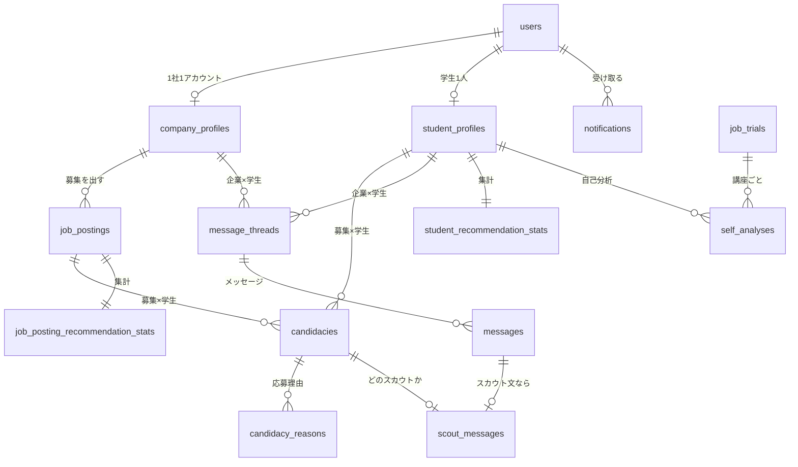

# データベースについて

README の「技術的・設計的工夫」の続きです。データベースの全体像と、設計で工夫したところを、表と図でまとめます。列の型や制約などの細かい定義は、設計書の [データベース.md](../design/designs/データベース.md) にあります。

## 目次

1. [全体像](#1-全体像)
2. [やりとり：関係の移り変わりを、そのまま表にする](#2-やりとり関係の移り変わりをそのまま表にする)
3. [会話：企業×学生で1本](#3-会話企業学生で1本)
4. [募集の状態](#4-募集の状態)
5. [学生と募集を同じ形で持つ](#5-学生と募集を同じ形で持つ)
6. [マスタ](#6-マスタ)
7. [データベースで守る決まり](#7-データベースで守る決まり)
8. [まとめて保存する範囲（トランザクション）](#8-まとめて保存する範囲トランザクション)
9. [あえて持たないもの](#9-あえて持たないもの)

---

## 1. 全体像

表は46個です（画像を保存するために Rails が自動で作る3つを含む）。

| 区分 | 表の数 | 中身 |
| --- | --- | --- |
| アカウント | 4 | ログイン情報、ログイン中のセッション、企業プロフィール、学生プロフィール |
| 付属情報 | 9 | 企業の業界・事業形態、学生のプログラミング歴・外部リンク・資格・興味のある業界・興味のある職種・出社できる都道府県・就活希望エリア |
| 募集 | 7 | 募集本体と、職種・工程・使用技術・業界・事業形態・求める学年 |
| やりとり・メッセージ | 5 | やりとり、応募理由、スレッド、メッセージ、スカウト文 |
| 通知 | 1 | 企業向けの「おすすめの学生」 |
| 推薦 | 2 | 学生ごと・募集ごとの集計（[検索について.md](検索について.md)） |
| マスタ | 10 | 職種（大分類・中分類）、工程、技術、業界、事業形態、都道府県、大学、学部、学科 |
| プチ職業体験 | 5 | 講座、講座の段階（ハードル）、講座の工程のタグ、募集に近い講座、自己分析 |
| 画像 | 3 | Rails（Active Storage）が自動で作る |

主な表のつながりは次のとおりです。

| 表の名前 | 呼び方 |
| --- | --- |
| candidacies | やりとり（応募とスカウトをまとめたもの） |
| message_threads | スレッド（会話1本） |
| scout_messages | スカウト文 |
| *_recommendation_stats | 推薦の集計 |
| job_trials・self_analyses | プチ職業体験の講座・自己分析 |

---

## 2. やりとり：関係の移り変わりを、そのまま表にする

### 2-1. 応募とスカウトを1つにまとめる

応募とスカウトは、関係を始めるきっかけ（発生元）が違うだけで、未マッチから先は同じ動きをします。そこで、1つの表にまとめ、**発生元と状態を別の列**で持ちました。

| 列 | 値 |
| --- | --- |
| 発生元 | 応募（0）／スカウト（1）。作った後は変えない |
| 状態 | 未マッチ（0）／マッチ（1）／見送り（2）／合格（3）／不合格（4） |

状態の中に発生元を含める（例：「スカウト待ち」「応募中」）と、「発生元は応募なのに、状態はスカウト待ち」のような矛盾したデータが作れてしまいます。列を分ければ、そもそも作れません。

### 2-2. 状態の移り変わり

| 今の状態 | 操作 | 押す人 | 次の状態 | 募集の条件 |
| --- | --- | --- | --- | --- |
| （なし） | 応募する | 学生 | 未マッチ（発生元＝応募） | 掲載中 |
| （なし） | スカウトする | 企業 | 未マッチ（発生元＝スカウト） | 掲載中 |
| 未マッチ・見送り | マッチする | 応募なら企業、スカウトなら学生 | マッチ | 掲載中 |
| 未マッチ | 見送る | 企業 | 見送り | 問わない |
| 見送り | 見送りを取り消す | 企業 | 未マッチ | 問わない |
| マッチ・合格・不合格 | 合格／不合格にする | 企業 | 合格／不合格 | 問わない |

- **後から意思表示した側がマッチを成立させる**：応募なら企業、スカウトなら学生が「マッチする」を押す。双方が合意して初めて会話ができる
- **できないこと**（呼ばれたら「今の状態ではできない」を返す）
  - 企業が、自分のスカウトに「マッチする」を押す
  - スカウトの取り消し、応募の取り消し（学生はスカウトを無視するだけ）
  - マッチ以降から、未マッチや見送りに戻す
  - 同じ募集×学生に、2件目のやりとりを作る

### 2-3. 同じ1行から、学生と企業で違う見え方を出す

画面に出すタグは保存せず、発生元と状態から計算します。

| 発生元 | 状態 | 企業に見えるタグ | 学生に見える状態 |
| --- | --- | --- | --- |
| 応募 | 未マッチ | 未対応応募 | 応募済み |
| スカウト | 未マッチ | スカウト済み | スカウトあり |
| 応募 | 見送り | 見送り | **応募済み** |
| スカウト | 見送り | 見送り | **スカウトあり** |
| どちらも | マッチ | マッチ | マッチ済み |
| どちらも | 合格・不合格 | 合格・不合格 | **マッチ済み** |

- 太字のところが工夫です。見送り・合格・不合格は、学生には見えません。企業の都合による見送りで、学生が傷つかないようにするためです
- 見え方を保存しないので、状態が変わっても、タグの更新漏れが起きません

### 2-4. 見送り・不合格は消さない

見送り・不合格は、関係を断つのではなく、企業の一覧から見えなくするための状態です。行は消さずに残します。

- 企業は「一覧を片付けたい」という動機で状態を付ける。それが、そのまま採用の転換率のデータになる
- 誤って見送っても、取り消せる

### 2-5. 応募理由は、1つずつの行で持つ

応募するとき・スカウトにマッチするときに、「募集のどこに惹かれたか」を12項目から1つ以上選びます。

| 番号 | 応募理由 | 番号 | 応募理由 |
| --- | --- | --- | --- |
| 0 | 事業内容 | 6 | 時給 |
| 1 | 業界 | 7 | 稼働条件 |
| 2 | 職種（中分類） | 8 | 使用技術 |
| 3 | 工程 | 9 | 事業形態 |
| 4 | インターンですること | 10 | 成長イメージ |
| 5 | カルチャー | 11 | 職種（大分類） |

- 1つの理由は、募集詳細の画面で1つのまとまりとして見せる項目に対応する。学生が、どの項目のことか迷わない
- 1行に12列ではなく、理由1つを1行で持つ。選択肢が増えても列を足さずに済み、あとで理由ごとに数えやすい
- やりとりの表には、理由の組を12ビットの数（例：事業内容と時給なら $2^0 + 2^6 = 65$）で写して持つ。おすすめの計算で、2人の応募理由の重なりを速く出すため（[検索について.md](検索について.md)）

---

## 3. 会話：企業×学生で1本

やりとりは「募集×学生」、会話は「企業×学生」で1本です。同じ企業から2つの募集でスカウトされたときに、募集ごとに会話を分けると、同じ相手とのやりとりが複数の画面に散らばるためです。

| 表 | 単位 | いつできるか |
| --- | --- | --- |
| スレッド | 企業×学生で1本 | スカウトを送ったとき、または応募がマッチしたときの早い方 |
| メッセージ | 1通ずつ | 送ったとき |
| スカウト文 | スカウト1件につき1つ | スカウトを送ったとき。メッセージとやりとりを結ぶ |

- メッセージの表は、種類に関係なく共通の「本文と送った人」だけを持ち、スカウト文のような種類ごとの情報は別の表で持つ。種類が増えても、メッセージの表は変えずに済む
- 同じ企業が2つの募集でスカウトすると、1本のスレッドにスカウト文が2つ並び、どの募集のスカウトかを表示できる

「会話を開けるか」と「メッセージを送れるか」は、別の条件にしています。

| 場面 | 会話を開ける | 送れる |
| --- | --- | --- |
| スカウトが届いた（未マッチ） | ○（スカウト文を読める） | × |
| 応募しただけ（未マッチ） | ×（まだ会話がない） | × |
| その企業×学生のやりとりに、マッチ以降が1つでもある | ○ | ○ |

- 会話を開ける条件：スレッドがあるか
- 送れる条件：その企業×学生のやりとりに、マッチ・合格・不合格が1つでもあるか
- スカウトを受けた学生が、文面を読んでからマッチを決められるように、2つを分けた。マッチするまでは、企業から追加のメッセージも届かない

---

## 4. 募集の状態

| 状態 | 学生から | 企業ができること |
| --- | --- | --- |
| 非公開（最初の状態） | 見えない | 編集。下書きとして使える |
| 掲載中 | 検索に出る。応募できる | スカウト、マッチ |
| 終了 | やりとりがある学生だけ「募集終了」として開ける | 見送り・合格・不合格（候補者の整理） |

- 3つの状態は自由に行き来できる（終了した募集を、もう一度掲載できる）
- **掲載中なら、「インターンですること」と「時給」は空にできない**。この決まりは、アプリだけでなくデータベースの CHECK 制約でも守る
- **最初に掲載した日時は、初めて掲載したときだけ記録し、再掲載では更新しない**。古い募集を出し直すだけで新着順の上に居座り、新しい募集が埋もれるのを防ぐため

---

## 5. 学生と募集を同じ形で持つ

比べたり、合う相手を探したりできるように、学生と募集はできるだけ同じ形で情報を持ちます。

### 5-1. 稼働条件：企業は下限、学生は上限

企業は「最低限ほしい量」、学生は「無理なく出せる量」を、同じ選択肢で答えます。

| 項目 | 企業（募集） | 学生 | 一致の決まり |
| --- | --- | --- | --- |
| 週の日数 | 週○日以上（1〜5） | 週○日まで（1〜5） | 学生 ≥ 企業 |
| 1日の時間 | 1日○時間以上（2／3／4／5／6／8） | 1日○時間まで（同じ） | 学生 ≥ 企業 |
| 続ける期間 | 最低○か月以上（1／3／6／9／12） | ○か月以上続けられる（同じ） | 学生 ≥ 企業 |
| 開始の時期 | ○年○月から（空欄は随時） | ○年○月から可能 | 学生の月 ≤ 企業の月（企業が随時なら常に一致） |
| 勤務形態 | 1つ選ぶ | 可能なものを複数選ぶ | 企業の形態が、学生の可能なものに含まれる |
| 勤務地 | 都道府県 | 出社できる都道府県（複数） | 企業がフルリモートなら問わない。それ以外は、企業の都道府県が学生の選んだものに含まれる |

- 数値は、選択肢の番号ではなく**実際の数（日数・時間・月数）**で保存する。選択肢を増やしても、今のデータの意味が変わらない
- 一致の決まりが「学生 ≥ 企業」という単純な比べ方だけなので、検索にも、学生詳細の比較にも、そのまま使える

### 5-2. 働き方の好み（学生）とカルチャー（募集）：同じ5つの軸

| 軸 | 左 | 右 | 参考にしたもの |
| --- | --- | --- | --- |
| 進め方 | まず動くものを作って見せ、直しながら進める | 仕様や設計を固めてから作り始める | リクルートの相性5軸「仕事への姿勢」 |
| 新しさ | 新しいライブラリや手法を積極的に試す | 使い慣れた、実績のある技術を選ぶ | 同「思考の方向性」 |
| 周囲との関わり | 自分で調べて一人でやり切る | こまめに相談しながらチームで進める | 同「周囲との関係」 |
| 決め手 | 数字や根拠がそろってから決める | 実現したいことへの想いを優先する | 同「判断の機軸」 |
| 職場の雰囲気 | 雑談や交流の場が多く、にぎやか | 各自が集中し、やりとりは必要なときだけ | ホフステードの組織文化の次元 |

- 値は −2〜2 の5段階。企業は、部署ごとに風土が違うので、会社単位ではなく募集ごとに答える
- 両端を形容詞ではなく具体的な行動で書き、「良さそうな方」を選びにくくした
- 検索の絞り込みには使わない（「この性格の学生は出さない」という使い方をさせないため）。おすすめの並び順と、比較の表示にだけ使う

### 5-3. 未入力の扱い

どの項目も任意なので、未入力をどう扱うかを場面ごとに決めています。

| 場面 | 未入力の扱い | 理由 |
| --- | --- | --- |
| 学生詳細の比較 | 判定せず「未入力」と表示する | 通えないのではなく、答えていないだけのため |
| 検索 | 条件を指定した項目が未入力なら、「合う」ではなく「合わない」の群に入れる（消しはしない） | 合っているとは言えないため |
| おすすめの計算 | その項目は0点 | 入力が多いほど上に出やすくなり、入力する動機になる |

---

## 6. マスタ

学生・募集・検索・講座で、同じ一覧を共通に使います。

| マスタ | 数 | 何を表すか | どこで使うか |
| --- | --- | --- | --- |
| 職種 | 大分類4・中分類21 | どんな仕事か | 募集、学生の興味のある職種、検索、おすすめ、プチ職業体験の講座 |
| 工程 | 13 | 仕事のどの段階か | 募集（メイン／関われる）、検索、おすすめ（募集どうし）、講座のタグ |
| 技術 | 52 | 言語・フレームワーク・クラウドなど | 募集の使用技術、学生のプログラミング歴、検索、おすすめ |
| 業界 | 15 | 何の分野の事業か | 募集、学生の興味のある業界、検索、おすすめ |
| 事業形態 | 4 | 誰にどう提供するか | 募集、検索 |

### 6-1. 中身

| 職種の大分類 | 中分類 |
| --- | --- |
| Web・アプリ開発 | フロントエンド、バックエンド、フルスタック、スマホアプリ、業務システム・DX、ゲーム・XR、組み込み・IoT |
| AI・データ | 生成AI・LLM、機械学習、データ分析、データ基盤、AI研究・論文実装 |
| インフラ・クラウド | クラウド構築、運用・信頼性向上、開発環境・自動化、ネットワーク |
| その他の技術職 | 品質保証・テスト、セキュリティ、研究開発、企画・PdM、社内IT・技術サポート |

| 段階 | 工程 |
| --- | --- |
| 上流 | 企画・要件定義、設計、課題設定、テスト計画・リスク評価 |
| 中流 | 実装、構築・自動化、データ収集・整備、分析・モデル開発・実験 |
| 下流 | テスト・評価、リリース・本番導入、運用・改善、監視・障害対応、発表・論文化 |

| マスタ | 中身 |
| --- | --- |
| 業界 | EC・小売、金融・保険、医療・ヘルスケア・介護、教育、ゲーム、エンタメ・メディア、広告・マーケティング、人材・HR、不動産・建設、製造・ものづくり、物流・交通・モビリティ、旅行・飲食・生活サービス、行政・公共、業界を問わない業務ツール、その他 |
| 事業形態 | 自社サービス（個人向け）、自社サービス（法人向け）、受託開発・SIer、社内システム |
| 技術 | 言語17、フレームワーク19、クラウド5、その他11 |

### 6-2. 決め方

- **軸を分けた**：「どんな仕事か（職種）」「どの段階か（工程）」「何の分野か（業界）」「誰にどう売るか（事業形態）」を別の一覧にし、検索で掛け合わせる。1つの木に混ぜると、項目の数が爆発するため
  - 例：以前は職種に「SE（要件定義・設計）」を置いていたが、「バックエンド × 上流の工程」で表せるので、工程の側に移した
  - 名前が似ていても別の軸：「ゲーム（業界）」と「ゲーム・XR（職種）」、「社内システム（事業形態）」と「業務システム・DX（職種）」
- **業界・事業形態は、会社と募集の両方に別々に持つ**：1つの会社に、自社サービスの部署と受託の部署があることが多いため。検索・おすすめ・比較では、募集の値だけを使う
- **番号ではなく、コードか名前で管理する**：環境ごとに番号が変わっても、同じ項目を指せる
- **消さない**：募集・学生・講座がすべて指しているため。隠したくなったら、表示するかどうかの列を足す

---

## 7. データベースで守る決まり

アプリの確かめに加えて、データベースの制約でも守っています。ボタンが同時に2回押されたときなどに、アプリの確かめをすり抜けても、データが壊れないようにするためです。

| 決まり | 制約 |
| --- | --- |
| 同じ募集×学生に、やりとりは1件だけ | UNIQUE（募集, 学生） |
| 同じ企業×学生に、スレッドは1本だけ | UNIQUE（企業, 学生） |
| 1つのやりとりに、スカウト文は1つだけ | UNIQUE（やりとり） |
| 1人×1講座に、自己分析は1件だけ | UNIQUE（学生, 講座） |
| 掲載中の募集は、「インターンですること」と「時給」が空でない | CHECK |
| 働き方の好み・カルチャーは −2〜2 | CHECK |
| 大学は、一覧から選んだものと、一覧にない名前の両方を同時には持たない | CHECK |

- UNIQUE に弾かれたら、「今の状態ではできない」エラーにする。スレッドは「作ってみて、弾かれたら今あるものを使う」
- 外部キーは既定の動き（指されている行は消せない）のまま。誤ってデータが消えることはない

---

## 8. まとめて保存する範囲（トランザクション）

途中で失敗したときに、半端な状態が残らないように、まとめて保存する範囲を決めています。

| 出来事 | まとめて保存するもの |
| --- | --- |
| スカウトを送る | やりとり、スレッド（なければ）、メッセージ、スカウト文 |
| 応募する・スカウトにマッチする | やりとり、応募理由、理由の写し（12ビットの数） |
| 企業が応募にマッチする | やりとりの状態、スレッド（なければ） |
| 新規登録 | アカウント、プロフィール、付属情報、推薦の集計の行、ログイン中のセッション |
| プロフィール・募集の保存 | 本体、付属情報、推薦の集計の項目の数 |

- 推薦の集計の数え直しと通知は、このまとまりが**確定した後に**、裏側のジョブで行う。推薦の計算が失敗しても、応募そのものは失敗しない（[検索について.md](検索について.md)）

---

## 9. あえて持たないもの

| 持たないもの | 理由 |
| --- | --- |
| 見送りの理由 | 企業の都合による見送りを、学生の不利な情報として残さないため。見送りは、おすすめにも通知にも使わない |
| 生年月日、出身地、都道府県より細かい住所 | 業務に必要な範囲だけを集めるため |
| どの募集を見たか、などの閲覧の記録 | 今回のおすすめの計算に要らないため。最終活動日だけは持つ |
| やりとりの状態の変更履歴 | 今回は持たない。返信率や転換率を期間ごとに出すなら、本番運用で足す |
| 募集の前提レベル（未経験可など）、使用技術の必要レベル | スキルを比べるのは既存のサービスが得意な領域なので、軽い対応にとどめたため |
| プチ職業体験の問題の正否、やり直しの回数 | 学生が学ぶためだけに使い、企業に見せないため |
| 学生どうし・募集どうしの近さ、似たもののリスト | 表示のたびに計算するため（[検索について.md](検索について.md)） |
